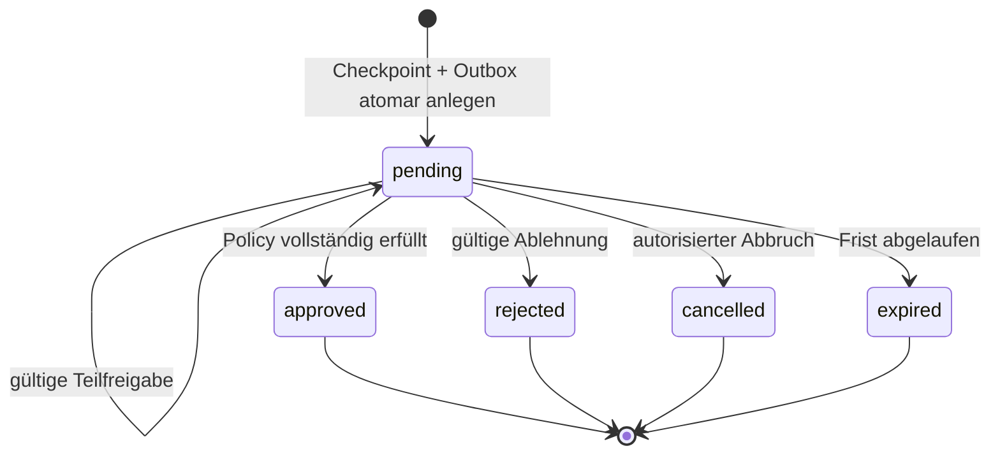

# Globale Freigabe-Checkpoints für Fachanwendungen

Dieses Dokument beschreibt den fachneutralen Vertrag, mit dem Fachanwendungen
folgenreiche Abläufe anhalten und nach einer autorisierten Entscheidung sicher
fortsetzen. Die Sicherheitsentscheidung dazu steht in
[`ADR-012`](adr/ADR-012-fachliche-freigaben-und-jit.md).

## 1. Verantwortungsgrenze

| Verantwortlich | Besitzt |
|---|---|
| Core Approval | Checkpoint-Zustand, Entscheidungen, Policy-Auswertung, JIT-Grants, Re-Authentifizierungsbezug, Audit und Events |
| Core Identity | Kontoart, Tenant-Mitgliedschaft, Session, Authentifizierungsverfahren und Assurance-Niveau |
| Fachmodul | fachliches Objekt, Auslöser, Policy-Key, erforderliche Fachberechtigung und Wirkung nach Freigabe oder Ablehnung |
| Worker | idempotente technische Fortsetzung nach einem verbindlichen Event |

Ein Fachmodul liest oder schreibt keine internen Tabellen der Capability. Es
verwendet versionierte Commands, Queries und Events. Der Core verändert keine
Fachtabelle eines Moduls.

## 2. Datenvertrag

```text
ApprovalCheckpoint
  id:                    UUID
  tenant_id:             UUID
  checkpoint_type:       String
  access_plane:          "work"
  resource_ref:          ResourceRef
  requested_by:          ActorRef
  policy_key:            String
  policy_version:        String
  required_permission:   String
  required_approvals:    Integer
  status:                pending | approved | rejected | expired | cancelled
  expires_at:            Timestamp?
  version:               Integer
  correlation_id:        String
  causation_event_id:    UUID?
  created_at:             Timestamp
  resolved_at:            Timestamp?

ApprovalDecision
  id:                    UUID
  tenant_id:             UUID
  checkpoint_id:         UUID
  decided_by:            ActorRef
  decision:              approve | reject
  reason:                String
  policy_version:        String
  reauthentication_ref:  UUID?
  jit_grant_ref:          UUID?
  decided_at:            Timestamp

ReauthenticationChallenge
  id, tenant_id, work_account_id, checkpoint_id, required_assurance,
  allowed_methods, status, expires_at, consumed_at

JustInTimeGrant
  id, tenant_id, work_account_id, permission, checkpoint_id, resource_ref,
  policy_version, reauthentication_ref, status, expires_at, remaining_uses
```

`resource_ref` enthält mindestens Tenant, registrierten Ressourcentyp und ID.
Freitext ist kein Ersatz für einen registrierten Ressourcentyp. Begründungen
werden klassifiziert und nach den geltenden Aufbewahrungsregeln gespeichert.

## 3. Zustandsmodell



Terminale Zustände sind unveränderlich. Eine Korrektur erzeugt einen neuen
Checkpoint und verweist auf den Vorgänger. Jede Mutation prüft die erwartete
Version, um doppelte oder konkurrierende Entscheidungen zu erkennen.

## 4. Work API v1

```http
GET  /api/v1/approval-checkpoints
GET  /api/v1/approval-checkpoints/{checkpoint_id}
POST /api/v1/approval-checkpoints/{checkpoint_id}/reauthentication
POST /api/v1/approval-checkpoints/{checkpoint_id}/grants
POST /api/v1/approval-checkpoints/{checkpoint_id}/decisions
POST /api/v1/approval-checkpoints/{checkpoint_id}/cancel
```

Beispiel für eine Entscheidung:

```http
POST /api/v1/approval-checkpoints/018f.../decisions
Idempotency-Key: 589fbf23-...
Content-Type: application/json

{
  "decision": "approve",
  "reason": "Budget und Leistungsumfang geprüft.",
  "expected_version": 3
}
```

Der Server leitet Actor, Kontoart, Tenant und Session aus der authentifizierten
Work Session ab. Vor dem Schreiben prüft er mindestens:

1. Übereinstimmung von Session-Tenant, Checkpoint-Tenant und ResourceRef,
2. Kontoart `work` und passende API-Audience,
3. erforderliche Berechtigung und aktuelle Policy-Version,
4. Maker-Checker- und Mehrpersonenregeln,
5. Ablauf und Zustand des Checkpoints,
6. erforderliches Assurance-Niveau sowie Bindung und Verbrauch eines JIT-Grants,
7. `Idempotency-Key` und `expected_version`.

Die Oberfläche zeigt Zielressource, fachliche Auswirkung, Begründung,
Entscheidungsstand und Sicherheitsanforderung. Ausgeblendete Schaltflächen sind
nur Benutzerführung; die Autorisierung erfolgt immer serverseitig.

## 5. Ereignisse v1

```text
core.approval.requested.v1
core.approval.approved.v1
core.approval.rejected.v1
core.approval.expired.v1
core.approval.cancelled.v1
core.approval.jit-grant-issued.v1
core.approval.jit-grant-consumed.v1
```

Jedes Ereignis enthält die gemeinsame Event-Hülle mit `event_id`, `tenant_id`,
`occurred_at`, `correlation_id`, `causation_id`, `actor_ref`, Schema-Version und
dem Checkpoint-Verweis. Sensible Authentifizierungsdaten, Tokens und Challenge-
Secrets werden niemals in Events veröffentlicht.

Der relevante Zustandswechsel und sein Outbox-Eintrag werden in derselben
PostgreSQL-Transaktion gespeichert. Consumer deduplizieren anhand der
`event_id`. Ein Event ist ein unveränderlicher Fakt, nicht der aktuelle Zustand.

## 6. Einbindung durch ein Fachmodul

Beispiel: Ein Fachmodul möchte einen Auftrag oberhalb eines Grenzwerts nur nach
Freigabe aktivieren.

1. Das Modul validiert den Auftrag und speichert seinen Zustand
   `awaiting_approval`.
2. Über den Core-Vertrag legt es atomar beziehungsweise über eine idempotente
   Saga einen Checkpoint mit `policy_key`, Ressourcenverweis und
   Korrelations-ID an.
3. Berechtigte `work`-Konten sehen den Checkpoint in ihrer Inbox. Falls die
   Policy es verlangt, absolvieren sie eine aktive Re-Authentifizierung und
   erhalten einen eng gebundenen JIT-Grant.
4. Der Core speichert die Entscheidung samt Audit und Outbox atomar.
5. Das Modul konsumiert `core.approval.approved.v1` idempotent, prüft den
   Ressourcen- und Versionsbezug und führt die fachliche Wirkung aus.
6. Fehler werden mit Backoff wiederholt; nach Ausschöpfung wird der Vorgang in
   den Dead-Letter-Zustand überführt. Die erteilte Entscheidung bleibt erhalten.

Wenn Modulzustand und Checkpoint nicht in derselben Datenbanktransaktion liegen,
ist eine idempotente Saga mit eindeutigem Business-Key erforderlich. Ein
verteilter Best-Effort-Doppelschreibvorgang ist unzulässig.

## 7. Policy-Anforderungen

Eine versionierte Freigabepolicy beschreibt mindestens:

- berechtigte `work`-Rollen oder Attribute,
- erforderliche Fachberechtigung und Ressourcenumfang,
- Zahl unabhängiger Freigaben,
- Maker-Checker- und Ausschlussregeln,
- Re-Authentifizierungsverfahren und Mindest-Assurance,
- Gültigkeit von Checkpoint und JIT-Grant,
- erlaubte Entscheidungen und Pflicht zur Begründung,
- Verhalten bei Ablauf, Ablehnung, Widerruf und Policy-Änderung.

Eine laufende Instanz behält ihre Policy-Version. Eine neue Policy wirkt nicht
rückwirkend, außer ein expliziter, auditierter Migrationsprozess ersetzt den
Checkpoint.

## 8. Abnahmekriterien für die spätere Implementierung

- Ein `admin`- oder `service`-Token kann keinen fachlichen Checkpoint lesen oder
  entscheiden; die Ablehnung ist serverseitig getestet.
- RLS und Anwendungsprüfung verhindern tenantübergreifenden Zugriff.
- Antragsteller-Selbstfreigabe wird bei Maker-Checker-Policy verhindert.
- Eine parallele oder wiederholte Entscheidung erzeugt höchstens eine Wirkung.
- Ein abgelaufener, verbrauchter oder ressourcenfremder JIT-Grant wird
  fail-closed abgelehnt.
- Entscheidung, Audit und Outbox sind atomar; ein Worker-Neustart verliert keine
  Freigabe und verdoppelt keine Fachwirkung.
- Policy-Version, Actor, Begründung, Authentifizierungsnachweis und Korrelation
  sind revisionssicher nachvollziehbar, ohne Geheimnisse zu protokollieren.
