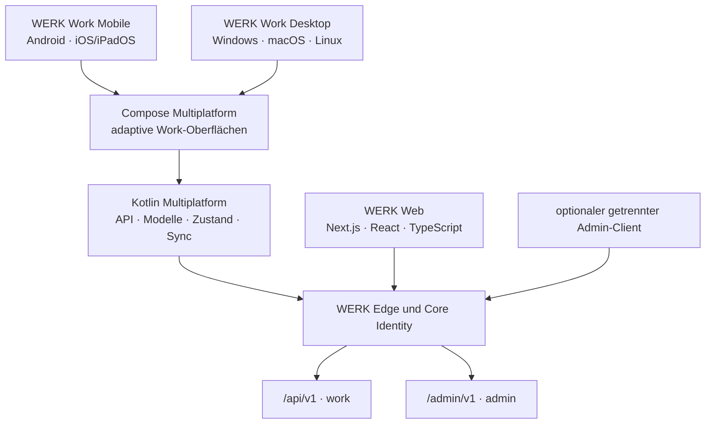

# WERK – Clientarchitektur

**Status:** Zielarchitektur, Umsetzung noch nicht begonnen  
**Entscheidung:**
[`ADR-013`](adr/ADR-013-native-clients-kotlin-compose-multiplatform.md)

Dieses Dokument konkretisiert die Clientseite von WERK. Es beschreibt die
Grenzen zwischen Web, installierbaren Work-Clients und möglichen späteren
Administrationsclients, ohne die konkrete Repositorystruktur vorzeitig
festzuschreiben.

## Zielbild



Web und native Clients sind gleichberechtigte API-Consumer. Sie besitzen keine
eigene fachliche Wahrheit und keine Sonderverbindung zum Backend.

## Zielplattformen und Reihenfolge

| Stufe | Produkt | Ziel | Voraussetzung |
|---|---|---|---|
| 1 | Web | Workspace und Administration | bestehender Plattformkern |
| 2 | Work Mobile | Android, iOS und iPadOS | stabiler Work-API-Vertrag und Native-Auth-ADR |
| 3 | Work Desktop | Windows, macOS und Linux | Mobile-Pilot, Packaging und Updatekanal |
| 4 | optionaler Admin-Client | ausgewählte Desktopfälle | eigener Bedarf, Bedrohungsmodell und getrenntes Artefakt |

Eine PWA ist keine dieser nativen Lieferstufen. Die responsive Weboberfläche
bleibt trotzdem auf mobilen Browsern erreichbar.

## Logische Clientmodule

Die spätere physische Projektstruktur soll mindestens folgende Grenzen
abbilden:

```text
client-contracts       OpenAPI-Modelle, Fehler und Kompatibilität
client-core            Sitzungszustand, Tenant-Kontext, Use Cases
client-sync            verschlüsselte Projektionen, Queue und Konflikte
client-design          semantische Tokens und gemeinsame Komponenten
client-work            Navigation und Work-Funktionen
platform-android       Keystore, Biometrie, Push, Hintergrundarbeit
platform-ios           Keychain, Biometrie, Push, BackgroundTasks
platform-desktop       Fenster, Tray, Dateien, Updates und Packaging
```

Diese Namen sind Verantwortungsgrenzen und noch keine Festlegung auf ein
bestimmtes Buildlayout. Admin- und Work-Code dürfen keine gemeinsame
umschaltbare Sitzungskomponente erhalten.

## API- und Datenvertrag

- OpenAPI ist die Quelle für Transportmodelle; handgeschriebene parallele DTOs
  an der Netzwerkgrenze werden vermieden.
- Jeder Request verwendet den serverseitig bestätigten Access Plane- und
  Tenant-Kontext. Ein Clientparameter kann diese Entscheidung nicht ersetzen.
- Problem Details, Request-ID, Correlation-ID, Idempotency Key, ETag und
  Versionskonflikte werden als gemeinsame Clientkonzepte behandelt.
- Echtzeit transportiert Hinweise. Nach einer Nachricht lädt der Client den
  autorisierten Zustand erneut über die Business-API.
- API-Kompatibilität wird in CI gegen alle unterstützten Clientversionen
  geprüft; ein Serverupdate darf einen noch unterstützten Client nicht
  stillschweigend brechen.

## Native Authentifizierung

Vor Implementierung wird das genaue Verfahren in einem Folge-ADR festgelegt.
Die Mindestgrenzen sind bereits verbindlich:

1. Anmeldung über den Systembrowser, nicht über eine eingebettete Login-WebView.
2. Schutz des Redirect-Flows mit PKCE, `state` und einmaliger Bindung an den
   gestarteten Clientvorgang.
3. Secrets ausschließlich im sicheren Plattformspeicher; keine Klartextdatei,
   allgemeine Preferences oder Web-LocalStorage.
4. Getrennte Audiences und lokale Speicherbereiche für `work` und `admin`.
5. MFA und Re-Authentifizierung bleiben serverseitige Policy-Entscheidungen.
6. Geräteverlust, Sessionwiderruf, Logout und Recovery besitzen definierte
   Lösch- und Sperrwirkungen.
7. Self-hosted Endpunkte unterstützen verwaltete private CAs, aber niemals einen
   Schalter zum Abschalten der TLS-Prüfung.

Origin- und CSRF-Schutz bleiben für Cookie-basierte Webaufrufe verbindlich.
Native Redirect-, Token- und Gerätebedrohungen werden zusätzlich und nicht als
Ersatz betrachtet.

## Offline-Fähigkeit

Offline wird pro Use Case freigegeben, nicht global eingeschaltet.

```text
Serverprojektion
    -> autorisierter Download
    -> verschlüsselter lokaler Cache
    -> lokale Anzeige mit Aktualitätsstatus
    -> optional vorgemerkter idempotenter Command
    -> erneute Policy-Prüfung und Konfliktauflösung am Server
```

Der Benutzer muss erkennen können, ob Daten aktuell, veraltet, nur lokal
vorgemerkt, synchronisiert oder in Konflikt sind. Ohne bestätigte
Serversynchronisation darf der Client keinen verbindlichen Abschluss anzeigen.
Hochriskante Freigaben und Sicherheitsänderungen werden nicht offline
entschieden.

## Dokumenttransfers

Clients adressieren Dokumente und veröffentlichte Versionen ausschließlich über
die versionierte Business-API. Der erste Upload-/Downloadvertrag verwendet
einen Backend-Transferendpunkt mit einem kurzlebigen, einmalig verbrauchbaren
und ressourcengebundenen Ticket. Bucket, Provider, opaker Objektschlüssel und
dauerhafte Storage-Credentials bleiben vollständig intern.

Eine spätere vorsignierte Provider-URL ist kein stiller Implementierungstausch,
sondern benötigt eine eigene Präzisierung für Widerruf, kurze TTL,
Content-Security, Logging und die hier festgelegte Clientgrenze. Lokale
Arbeitskopien bleiben verschlüsselte Clientzustände; erst eine erneut
autorisierte Serververöffentlichung erzeugt eine kanonische Dokumentversion.
Details stehen in
[`ADR-021`](adr/ADR-021-interner-dokument-blob-und-transfervertrag.md); Änderungen
vorbehalten.

Die Dokumentoberfläche wächst gemeinsam mit den freigegebenen Serververträgen:
zuerst Liste, Detail, Klassifikation und unveränderliche Versionshistorie,
danach Upload-/Downloadaktionen mit sichtbaren Prüf- und Fehlerzuständen und
erst später Arbeitskopien, Sync und Konfliktbehandlung. `unknown`, `missing`,
Quarantäne und Policy-Ablehnung werden als echte Serverzustände dargestellt;
der Client erfindet keinen lokalen Erfolgszustand und zeigt weder Provider noch
opake Storage-Schlüssel an. Änderungen vorbehalten.

## Adaptive Oberfläche

- Smartphone verwendet fokussierte, schrittweise Abläufe und kurze
  Navigationswege.
- Tablet nutzt Master-Detail, geteilte Arbeitsflächen und optionale Tastatur-
  beziehungsweise Stiftbedienung.
- Desktop nutzt dichte Listen, Mehrspaltenansichten, Tastatursteuerung, Fenster
  und lokale Integration.
- Gemeinsame Compose-Komponenten bleiben semantisch identisch, dürfen aber
  plattformspezifisches Verhalten und Layout besitzen.
- Kontoart, aktiver Tenant, Offlinezustand und sicherheitsrelevante Wirkungen
  bleiben sichtbar und barrierefrei verständlich.

## Fachmodule und Erweiterungen

Ein Fachmodul registriert neben Ressourcen, Berechtigungen und Ereignissen auch
seine unterstützten Clientoberflächen. Eine serverseitig installierte App ist
nicht automatisch in jeder ausgelieferten Clientversion darstellbar.

Native Beiträge benötigen:

- eine versionierte Client-Capability,
- eine bekannte Route und Berechtigungsanforderung,
- kompatible Datenverträge,
- einen sicheren Fallback oder eine verständliche Nichtverfügbarkeit.

Beliebiges HTML oder JavaScript wird nicht als Erweiterung in eine native
Oberfläche geladen. Ein externer Browserlink kann ausdrücklich angeboten
werden, macht die native App aber nicht zur PWA- oder WebView-Shell.

## Liefer- und Qualitätsgrenzen

Vor dem ersten produktiven Mobile-Release müssen mindestens vorhanden sein:

- angenommenes Native-Auth-ADR und Bedrohungsmodell,
- signierte Android- und Apple-Artefakte aus reproduzierbarer CI,
- Abhängigkeits- und Lizenzprüfung sowie SBOM,
- sichere Konfiguration der Self-hosted Serveradresse,
- Tests für Tenant-/Kontoarttrennung, Sessionwiderruf und Offlinekonflikte,
- Metriken und Crashberichte ohne Tokens oder unnötige Fachdaten,
- dokumentierte Mindestversionen und Supportzeitraum,
- Rollout-, Update- und Rücknahmeverfahren.

Für Desktop kommen Codesignierung, Paketformate, automatischer Updatekanal und
Tests für Fenster-, Datei- und Betriebssystemintegration hinzu.

## Bewusste Nicht-Ziele der ersten Ausbaustufe

- keine vollständige Spiegelung des Web-Admin-Portals auf Smartphones,
- keine vollständige Offline-Kopie eines Tenants,
- keine ungeprüfte Ausführung serverseitiger Plugin-Oberflächen,
- keine gemeinsame Work-/Admin-Sitzung,
- kein direkter Datenbank-, Valkey- oder Object-Storage-Zugriff,
- keine Ablösung der bestehenden Weboberfläche.
