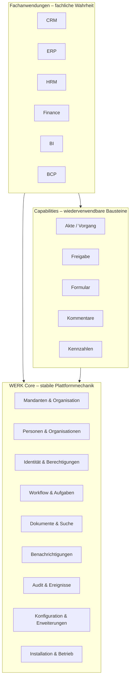
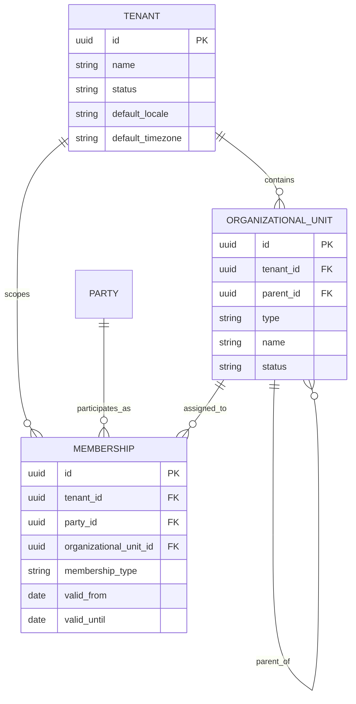
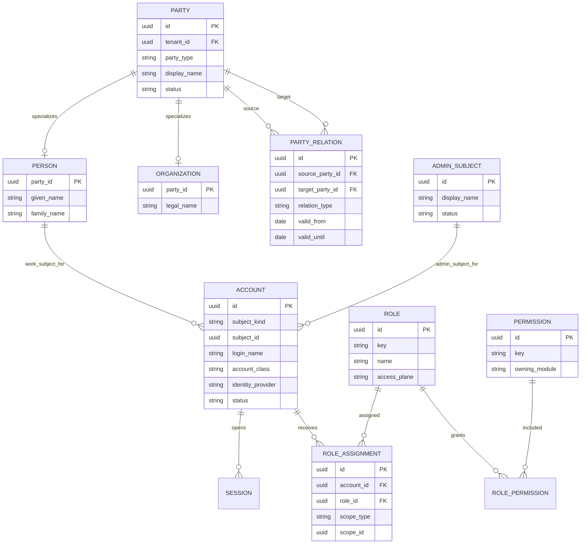
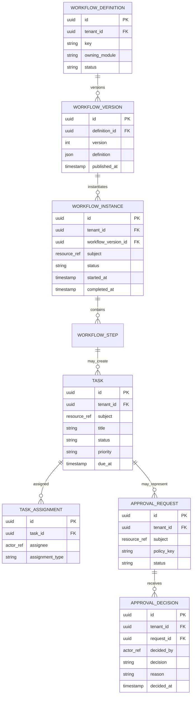
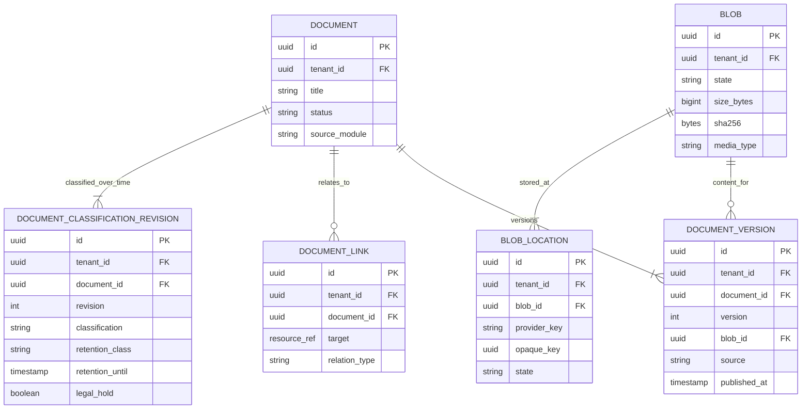
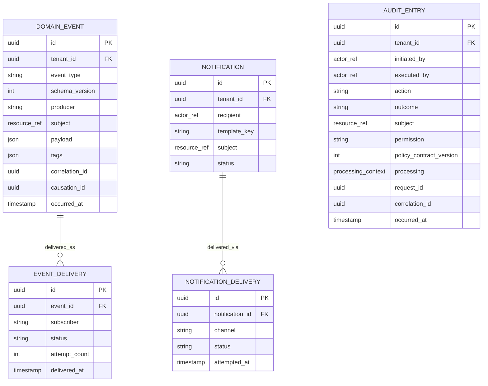
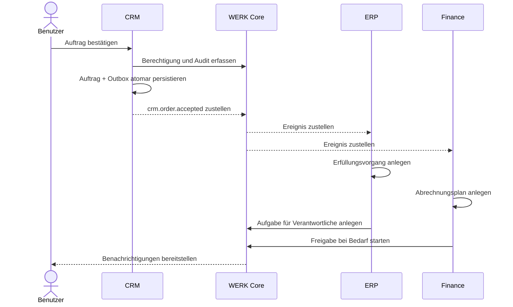

# WERK – konzeptionelles Datenmodell

**Status:** Architekturgrundlage, noch kein finales physisches Datenbankschema  
**Zielgruppe:** Entwickler, Architekten und Modulautoren

WERK ist ein modulares Unternehmensbetriebssystem. Der **WERK Core** besitzt die
unternehmensweit gültigen Strukturen und Mechanismen. Wiederverwendbare
**Capabilities** kombinieren diese Mechanismen. **Fachanwendungen** besitzen ihre
Fachbegriffe, Regeln und Fachdaten.

Die zentrale Regel lautet nicht „alles Gemeinsame gehört in den Core“, sondern:

> Der Core besitzt stabile, fachneutrale Mechanismen. Eine Capability macht daraus
> einen wiederverwendbaren Baustein. Eine Fachanwendung besitzt Bedeutung,
> Fachregeln und fachliche Darstellung.

---

## 1. Gesamtübersicht



Fachanwendungen dürfen Core-Objekte referenzieren und Core-Dienste verwenden. Sie
dürfen weder Tabellen eines anderen Moduls direkt verändern noch gemeinsame
Strukturen als private Parallelmodelle neu anlegen.

---

## 2. Gemeinsame Modellkonventionen

### 2.1 Identifikatoren und Mandantengrenze

Alle fachlich relevanten Datensätze verwenden nicht erratbare, global eindeutige
IDs, vorzugsweise UUIDv7. Jeder **mandantenabhängige** Datensatz trägt eine
`tenant_id` oder ist über eine nicht veränderbare Elternreferenz eindeutig an
denselben Mandanten gebunden; installationsweite Betriebs- und
Administrationsdaten sind davon ausgenommen. Ein Mandant ist die oberste
Sicherheits- und Datengrenze innerhalb einer Installation.

```text
id             UUIDv7       globale technische Identität
tenant_id      UUIDv7       oberste Daten- und Sicherheitsgrenze
created_at     timestamptz  Erzeugungszeitpunkt in UTC
created_by     actor_ref    auslösender Benutzer oder Systemdienst
updated_at     timestamptz  letzter Änderungszeitpunkt in UTC
version        bigint       optimistische Nebenläufigkeitskontrolle
```

Nicht jede Tabelle benötigt alle Felder. Unveränderliche Ereignisse besitzen zum
Beispiel kein `updated_at`.

Eine **Installation** ist eine logische Daten-, Sicherheits- und
Identity-Grenze. Eine **Instanz** ist ein ausführender Knoten beziehungsweise
eine betriebliche Replik innerhalb derselben Installation. Zwei HA-Instanzen
dürfen daher nicht als zwei unabhängige fachliche Wahrheiten behandelt werden.
Sie teilen ein `IdentityRealm`, dieselben Tenants und – nach kontrollierter
Promotion – genau eine schreibende Identity-Autorität. Unabhängige
Installationen werden nicht durch Replikation zu einem gemeinsamen Tenant.

### 2.2 Referenzen über Modulgrenzen

Module teilen keine Fremdschlüssel auf ihre privaten Tabellen. Für
modulübergreifende Bezüge wird eine typisierte Ressourcenreferenz verwendet:

```text
ResourceRef {
  tenant_id: UUID
  kind:      String    // z. B. "crm.customer" oder "finance.invoice"
  id:        UUID
}
```

Der `kind` wird zentral registriert. Eine Referenz gibt keine Schreibberechtigung
auf das Zielobjekt. Anzeige, Suche und Zugriff erfolgen über die öffentliche
Schnittstelle des besitzenden Moduls.

`ActorRef` verweist auf das auslösende Konto und dessen Kontoart. Damit bleiben
Arbeits-, Admin- und Service-Akteure im Audit eindeutig unterscheidbar. Eine
`PartyRelation` darf nur Parteien desselben Mandanten verbinden; eine Beziehung
über Mandantengrenzen ist kein gültiger Core-Datensatz.

### 2.3 Datenhoheit

Jeder Datentyp besitzt exakt einen Owner:

| Objekt | Owner | Andere Module dürfen |
|---|---|---|
| Benutzerkonto | Core Identity | referenzieren, Berechtigungen prüfen |
| Person / Organisation | Core Party | Beziehungen und Fachrollen ergänzen |
| Datei / Dokumentversion | Core Documents | ablegen, klassifizieren, referenzieren |
| Aufgabe | Core Work | erzeugen, fachlichen Kontext referenzieren |
| Kundenbeziehung | CRM | lesen, sofern autorisiert; Ereignisse abonnieren |
| Beschäftigungsverhältnis | HRM | lesen, sofern autorisiert; niemals selbst ändern |
| Buchung / Beleg | Finance | ausschließlich über Finance-Kommandos verändern |

---

## 3. Core-Domänen

### 3.1 Mandanten und Organisation



- `Tenant` ist eine isolierte Unternehmenswelt, nicht automatisch eine juristische
  Person.
- `OrganizationalUnit` bildet Gesellschaft, Standort, Bereich, Abteilung oder Team
  als konfigurierbaren Typ ab.
- `Membership` beschreibt die organisatorische Zugehörigkeit einer Partei. Ein
  HR-Beschäftigungsverhältnis bleibt trotzdem Fachdaten des HRM.

Organisationseinheiten bilden die stabilen „Zwiebelschalen“ des Unternehmens.
Querliegende Zugriffszusammenhänge werden nicht als zweite Hierarchie
modelliert, sondern als tenantgebundene `AccessGroup`-Kanten. Eine Gruppe kann
Work-Konten oder Organisationseinheiten enthalten; eine Einheit kann ihre
Nachfahren nur über ein ausdrückliches Flag einbeziehen. Verschachtelte
Access-Gruppen sind im ersten Vertrag ausgeschlossen.

```text
AccessGroup
  id, tenant_id, group_key, display_name, governing_unit_id?,
  status, contract_version

AccessGroupMembership
  id, tenant_id, access_group_id,
  account_id? xor organizational_unit_id?, include_descendants,
  valid_from, valid_until?, status, contract_version
```

`governing_unit_id` bezeichnet einen später delegierbaren Verwaltungsbereich,
aber keine neue Tenant- oder Datenhoheitsgrenze. Den verbindlichen Vertrag
beschreibt
[`ADR-018`](adr/ADR-018-organisationskoordinaten-und-app-entitlements.md).

### 3.2 Parteien, Identitäten und Zugriff

**Core Identity** ist die interne Identitäts- und Zugriffsschicht von WERK. Sie
kann selbst als Identity Provider arbeiten. Externe Provider wie OIDC, SAML oder
LDAP werden später ausschließlich über Adapter angebunden: Sie bestätigen eine
Identität, erhalten aber keine Hoheit über Kontoart, Tenant-Zuordnung,
Session-Audience, Berechtigungen oder Audit. Dadurch bleibt die Trennung von
`work`, `admin`, `service` und tenantgebundene `agent`-Principals unabhängig vom
gewählten Anmeldeverfahren.

Provider-, Principal-, Credential- und Audience-Grenzen sind in
[`ADR-014`](adr/ADR-014-principals-provider-credentials-und-audiences.md)
festgelegt. Die spätere Active/Passive-Autorität mit Platform Witness, Lease,
Autoritätsgeneration und Fencing beschreiben
[`ADR-015`](adr/ADR-015-identity-authority-witness-und-failover.md) und
[`ADR-022`](adr/ADR-022-deploymentprofile-und-platform-witness.md).

Eine reale Person, eine Organisation, ein Arbeitskonto und ein
Administrationssubjekt sind verschiedene Objekte. Dadurch kann dieselbe Person
Mitarbeitende, Kundenkontakt und Benutzerin sein, ohne mehrfach angelegt zu
werden. Die administrative Identität bleibt dabei außerhalb der Mandantendaten.

#### Harte Trennung: Arbeit und Administration

WERK trennt zwei Sicherheitsbereiche. Ein Administrationskonto ist **kein**
normaler Benutzer mit zusätzlichen Rechten und ein Arbeitskonto ist **kein**
eingeschränktes Administrationskonto.

| Kontoart | Zweck | Darf nicht |
|---|---|---|
| `work` | tägliche Arbeit in Fachanwendungen | Installation, globale Sicherheits- oder Plattformkonfiguration verwalten |
| `admin` | Installation, Core, Apps, Identität und Betrieb verwalten | Facharbeit ausführen, Aufgaben bearbeiten oder reguläre Geschäftsdaten verwenden |
| `service` | technische Integration oder Automatisierung | interaktive Anmeldung oder menschliche Arbeitsoberfläche nutzen |
| `agent` | gespeicherter tenantgebundener Software-Akteur mit technischen Credentials | interaktive Anmeldung, implizite Benutzervertretung oder direkte Fach-/Datenbankzugriffe nutzen |

Dieselbe reale Person darf ein Arbeitskonto und ein Administrationskonto besitzen,
etwa `marc@unternehmen` und `marc.admin@unternehmen`. Die Konten haben getrennte
Sitzungen, Tokens, MFA-Regeln, Audit-Akteure und APIs. Beide Kontoarten verwenden
dieselbe neutrale öffentliche Login-Oberfläche. Nach erfolgreicher
Identitätsprüfung bestimmt ausschließlich der Server aus dem eindeutig
zugeordneten Konto dessen unveränderliche Kontoart und öffnet den passenden
Bereich. Das Frontend übermittelt weder eine Kontoart noch eine Rollenwahl. Ein
Wechsel per Button innerhalb derselben Sitzung ist nicht zulässig; eine neue
Anmeldung mit dem jeweils anderen Konto ist erforderlich.

```text
Arbeitsbereich                 Administrationsbereich
/api/v1/...                   /admin/v1/...
Frontend: WERK Workspace      Frontend: WERK Admin
Account class: work           Account class: admin
App-Rollen und Aufgaben       Plattform- und Betriebsrechte
```

Fachliche Leitungsrollen wie „Vertriebsleitung" oder „HR-Verantwortung" bleiben
Arbeitsrollen. Sie sind keine Administrationskonten, auch wenn sie innerhalb
einer Fachanwendung weitreichende fachliche Freigaben erhalten.



Eine Berechtigungsentscheidung lautet konzeptionell:

```text
authorize(actor, permission, resource, context) -> allow | deny
```

Der erste ausführbare Ressourcenvertrag ist in
[`ADR-016`](adr/ADR-016-plattformweiter-ressourcen-und-autorisierungsvertrag.md)
festgelegt. Installationsweit registrierte Module besitzen genau ihren
Namensraum; Ressourcentypen deklarieren eine Grenze `installation` oder
`tenant`, und jede Berechtigung muss explizit auf ihre zulässigen
Ressourcentypen zeigen. Eine `ResourceRef` enthält Grenze, Typ und stabile ID
sowie bei tenantgebundenen Ressourcen zwingend den Tenant. `tenant_id = null`
ist niemals eine implizite Freigabe für alle Mandanten.

Der ergänzende Datenschutz- und Compliance-Vertrag ist in
[`ADR-017`](adr/ADR-017-eu-compliance-und-datenverarbeitungsgrundlage.md)
festgelegt. Jeder autorisierbare Ressourcentyp benötigt ein aktives,
versioniertes `ResourceDataProfile`. Jede Permission-Ressourcentyp-Bindung
benötigt außerdem eine aktive `ProcessingPolicy`. Fehlt einer der beiden
Verträge, wird der Zugriff geschlossen abgelehnt. Für personenbezogene
Ressourcentypen verlangt der Vertrag einen serverseitigen `ProcessingContext`;
eine erfolgreiche Autorisierung oder Rolle gilt ausdrücklich nicht als
Rechtsgrundlage. Die heutige Basis prüft Profil, Policy und Kontext gemeinsam.
Das Betreiberregister freigegebener Verarbeitungstätigkeiten und dessen
Governance folgen versioniert.

`RoleAssignment.scope` begrenzt eine Rolle beispielsweise auf einen Mandanten,
eine Organisationseinheit oder eine konkrete Ressource. Fachmodule registrieren
ihre Berechtigungen im Core, entscheiden aber weiterhin über fachliche Regeln wie
Betragsgrenzen oder Funktionstrennung.

Bei `work` ist `ACCOUNT.subject_kind` zwingend `party.person`; bei `admin` ist es
zwingend `installation.admin_subject`, bei `agent` ein tenantgebundener,
registrierter Agent. Datenbank-Constraints erzwingen diese Kombinationen.
Ein Agent verwendet den technischen API-Bereich, erhält daraus aber keine
Modell-, Tool- oder Fachberechtigung. `ROLE.access_plane` muss außerdem zur
zulässigen Kontoartzuordnung passen. Dadurch
kann eine Admin-Identität nicht versehentlich Teil einer Kunden-, Personal- oder
Fachakte werden.

Admin-Rollen sind ausschließlich installationsweit oder auf einen expliziten
administrativen Bereich begrenzt. Sie dürfen nie auf Fachressourcen oder
Organisationseinheiten zeigen.

Vor jeder Berechtigungsentscheidung erfolgt eine Bereichsprüfung. Ein Token eines
`work`-Kontos kann keinen `/admin/v1`-Endpunkt aufrufen; ein Token eines
`admin`-Kontos kann keine Fach-API oder Workspace-Aktion aufrufen. Diese Trennung
wird serverseitig erzwungen, nicht nur durch unterschiedliche Menüeinträge.

### 3.3 Arbeit, Workflows und Freigaben



- Der Core kennt Ausführung, Zustände, Zuweisung, Fristen und Eskalation.
- Das besitzende Fachmodul definiert Anlass, erlaubte Übergänge und Wirkung eines
  fachlichen Abschlusses.
- Eine veröffentlichte Workflow-Version wird nicht nachträglich verändert. Neue
  Instanzen verwenden eine neue Version; laufende bleiben reproduzierbar.
- Fachliche Wartepunkte werden als dauerhafte `ApprovalCheckpoint`s modelliert.
  Ausschließlich tenantgebundene `work`-Konten dürfen sie nach serverseitiger
  Policy-Prüfung entscheiden; `admin`- und `service`-Konten sind ausgeschlossen.
  Eine Policy kann aktive Re-Authentifizierung, Mehrpersonenfreigabe und einen
  kurzlebigen, ressourcengebundenen Just-in-Time-Grant verlangen. Details und
  Integrationsvertrag stehen in
  [`ADR-012`](adr/ADR-012-fachliche-freigaben-und-jit.md) und
  [`APPROVAL-CHECKPOINTS.md`](APPROVAL-CHECKPOINTS.md).
- Ein wartender Checkpoint bindet keinen Worker. Zustandswechsel und Outbox-
  Ereignis werden atomar gespeichert; die fachliche Fortsetzung erfolgt
  idempotent über ein versioniertes Ereignis.

### 3.4 Dokumente und Suche



Core Documents besitzt Dokument, veröffentlichte Version, Klassifikationshistorie
und fachliche Sichtbarkeit. `source_module` bezeichnet den fachlichen Erzeuger
und nicht den Datenowner. Core Storage besitzt Blob, Blob-Location, Quarantäne,
Transferzustand und den Provideradapter. Der Object Store hält nur Bytes und ist
keine Berechtigungs- oder Dokumentenwahrheit.

Jede gezeigte tenantbezogene Tabelle trägt `tenant_id`. Dokument-Version-,
Blob-, Location-, Link- und Klassifikationsbezüge verwenden zusammengesetzte
Tenant-Fremdschlüssel. Eine `DocumentVersion` ist nach Veröffentlichung
unveränderlich. Größe, erkannter Medientyp und serverseitiger SHA-256-Digest
gehören zum versiegelten Blob; sie werden nicht als abweichende zweite Wahrheit
in der Version geführt. Mehrere Versionen dürfen innerhalb desselben Tenants
denselben Blob referenzieren.

Ein versiegelter Blob wechselt bei einer nicht entscheidbaren Providerprüfung
auf `unknown` und bei bestätigtem Fehlen aller nutzbaren Locations auf
`missing`. Beide Zustände sperren Zugriffe fail-closed, behalten aber Hash,
Größe und Medientyp für Restore und Reconciliation. `available` darf erst nach
erneuter Verifikation einer bestehenden oder reparierten Location wieder
gesetzt werden; Änderungen vorbehalten.

Ein neues Dokument wird erst mit einer erfolgreich geprüften Version 1 sichtbar.
Unvollständige Transfers und Quarantäne-Blobs sind keine Dokumentversionen. Der
erste produktive Transfer verwendet ein kurzlebiges, einmalig verbrauchbares,
an Actor, Tenant, Aktion und Ressource gebundenes Ticket. Ticket-Rohwerte,
Provider-Credentials und Objektpfade erscheinen weder in Audit noch in Events
oder Logs.

Ein Suchtreffer ist kein zweiter Datensatz, sondern ein berechtigungsgeprüfter
Indexeintrag mit `ResourceRef`, Titel, Ausschnitt und Zielaktion. Fachmodule liefern
indexierbare Projektionen; der Core betreibt Index und Suche.

`Blob` ist mandantengebunden. Eine Deduplizierung von Dateien über
Mandantengrenzen hinweg ist nicht zulässig, damit weder Inhalt noch Metadaten
eines anderen Mandanten ableitbar werden.

Ein späterer Collaboration-/Sync-Dienst besitzt veränderliche Arbeitskopien,
Revisionen, Sync-Cursor und Konflikte. Er erzeugt keine eigene Identity, ACL-
oder Dokumentwahrheit und veröffentlicht akzeptierte Arbeitsstände ausschließlich
als neue `DocumentVersion`. Den ausführbaren Ausbauplan beschreiben
[`ADR-021`](adr/ADR-021-interner-dokument-blob-und-transfervertrag.md) und
[`DOCUMENT-STORAGE.md`](DOCUMENT-STORAGE.md); Änderungen vorbehalten.

### 3.5 Benachrichtigungen, Audit und Ereignisse



- Domain-Events beschreiben fachlich relevante Tatsachen, besitzen eine
  Schema-Version und sind unveränderlich.
- Audit-Einträge beantworten: wer hat wann wodurch welche geschützte Ressource
  verändert, freigegeben, exportiert oder – falls die Datenklasse es verlangt –
  eingesehen?
- Fachliche Audit-Einträge unterscheiden den auslösenden Actor
  (`initiated_by`) vom authentifizierten technischen Principal
  (`executed_by`). Ein Service vertritt einen Work-Actor nicht implizit. Bei
  einer rein technischen Aktion dürfen beide Referenzen auf denselben
  tenantgebundenen Service oder Agenten zeigen.
- Permission, Policy-Vertragsversion und ein erforderlicher Processing-Kontext
  werden aus der serverseitigen Entscheidung übernommen. Requestdaten dürfen
  Zweck oder Rechtsgrundlagenreferenz nicht selbst setzen.
- Ein versionierter Audit-Action-Vertrag bindet Ereignistyp und Aktion an genau
  eine Permission und Ressourcenart. Eine neue Bedeutung benötigt eine neue
  Version; vorhandene Auditgeschichte wird nicht nachträglich umgedeutet.
- Benachrichtigungen sind Benutzerkommunikation und dürfen aus Ereignissen
  entstehen, sind aber nicht dasselbe wie Ereignisse.
- Audit und Ereignis sind getrennte Aufzeichnungen: Eine Änderung kann beides,
  nur einen der Einträge oder keinen Domain-Event erzeugen. `correlation_id`
  verbindet zusammengehörige Abläufe ohne eine falsche 1:1-Beziehung zu erzwingen.
- Eine kritische Fachänderung und ihr Outbox-Eintrag werden im besitzenden Modul
  atomar gespeichert. Der Core übernimmt Zustellung, Nachverfolgung und
  Abonnementverwaltung.
- Jedes Domain-Event besitzt begrenzte Tags für Datenklassifikation,
  Verarbeitungszweck und Aufbewahrungsklasse. Tags sind weder Rollen noch
  Berechtigungen und dürfen keine freien Secrets oder Personendaten tragen.
- Kafka verteilt das versionierte Event-Envelope aus der PostgreSQL-Outbox.
  Security-Audits werden über eine atomare, minimierte Exportprojektion getrennt
  veröffentlicht; freie Details und Session-IDs verlassen den autoritativen
  Auditdatensatz nicht.
- Domain-Event-, Audit- und Log-Topics sind getrennte Sicherheits- und
  Retentionräume. Kafka-Retention ersetzt keine fachliche Aufbewahrung, kein
  Legal Hold und keinen Auditnachweis. Details und Änderungsgrenzen beschreibt
  [`ADR-020`](adr/ADR-020-kafka-event-audit-und-log-streaming.md); Änderungen
  vorbehalten.

### 3.6 Konfiguration, Apps und Erweiterungen

```text
AppModuleRegistration
  module_key, module_kind=app, display_name, contract_version, status

TenantAppInstallation
  tenant_id, app_module, status, contract_version

AppEntitlement
  id, tenant_id, app_module,
  account_id? xor organizational_unit_id? xor access_group_id?,
  include_descendants, valid_from, valid_until?, status, contract_version

ResourceTypeRegistration
  owner_module, kind, display_name, boundary, contract_version, status

ResourceDataProfile
  resource_kind, personal_data_category, confidentiality_level,
  processing_activity_required, contract_version, status

PermissionRegistration
  owner_module, permission_key, display_name, access_plane,
  risk_level, contract_version, status

PermissionResourceType
  permission_key, resource_kind

ProcessingPolicy
  permission_key, resource_kind, processing_required,
  activity_key?, purpose_key?, legal_basis_ref?, contract_version, status

ProcessingContext
  activity_key, purpose_key, legal_basis_ref

EventTypeRegistration
  app_id, event_type, schema_version, payload_schema

ExtensionPointRegistration
  app_id, extension_point, contribution_type, configuration

ServiceContract
  service_key, owner_module, contract_version, lifecycle

ServiceCapabilityContract
  service_key, service_contract_version, capability_key,
  capability_version, operation_boundary, lifecycle

ProviderRegistration
  id, service_key, service_contract_version, provider_key, adapter_key,
  config_scope, tenant_id?, registry_contract_version, lifecycle, revision

ProviderCapabilityBinding
  provider_id, service_key, service_contract_version,
  capability_key, capability_version, lifecycle, revision
```

Der Core verwaltet Registrierung, tenantbezogene Aktivierung und explizite
App-Freischaltung. Eine App bleibt Owner ihrer Fachdaten. Ein
`AppEntitlement` öffnet nur die App-Tür für ein Work-Konto, eine
Organisationseinheit oder eine Access-Gruppe; es erteilt weder Rolle noch
Permission. Erweiterungspunkte sind versionierte Verträge und kein direkter
Zugriff auf interne Core-Strukturen.

Die Basisregister für Module, Ressourcentypen, Datenprofile,
Permission-Ressourcentyp-Zuordnungen und deren Processing-Policies sind
umgesetzt. Tenant-App-Installationen, Access-Gruppen und App-Entitlements sind
als tenantgesicherte Datenbank- und pure Go-Verträge vorhanden. Die zentrale
Policyentscheidung wertet den `ProcessingContext` zusammen mit Actor,
Permission, Ressource und Grants aus. Verwaltungs-API, Manifestprüfung,
Routenvorlagen, Suchprojektionen, der erste Fachapp-Verbraucher und frei
konfigurierbare Policy-Facts folgen. Änderungen vorbehalten.

Die globale Service-/Provider-Registry ist ein deklarativer Metadatenkatalog
für logische Dienste, erlaubte technische Capabilities, konkrete
Providerinstanzen und deren ausdrückliche Bindungen. `ConfigScope` beschreibt,
ob eine Providerkonfiguration installations- oder tenantgebunden ist;
`operation_boundary` beschreibt unabhängig davon, ob die konkrete Operation
einen Tenant-Kontext benötigt. Ein installationsweit konfigurierter Provider
darf Tenantoperationen ausführen, ohne deren Tenant-Kontext aufzuheben.

Die Auflösung verlangt immer eine konkrete Provider-ID und exakt passende
Registry-, Dienst- und Capability-Vertragsversionen. Sie wählt keinen Provider
automatisch und liefert eine gemeinsam an Provider, Adapter, Capability,
Operationsgrenze und Tenant-Kontext gebundene Entscheidung. Die Registry
enthält keine Secrets, Schlüssel, Zertifikate, Tokens, Endpunkte, Objektpfade,
freie Providerkonfiguration oder Healthdaten und erteilt weder RBAC-Rechte noch
Mehrinstanz-Schreibhoheit. Identity-Bindings und Storage-Locations bleiben bei
ihren jeweiligen Core-Domänen. Den verbindlichen Vertrag beschreibt
[`ADR-025`](adr/ADR-025-globale-service-und-provider-registry.md); Änderungen
vorbehalten.

### 3.7 Geschäftsobjekte, Beziehungen und Entscheidungen

WERK benötigt eine gemeinsame Sprache für Zusammenhänge, ohne alle Fachmodelle
in eine generische Tabelle zu pressen. Ein Geschäftsobjekt ist daher ein
**kanonisch referenzierbares Fachobjekt** – etwa ein Projekt, Kunde, Vertrag,
Ticket, Asset oder Dokument – und keine zweite Quelle seiner Fachdaten.

```text
BusinessObjectView
  ref:              ResourceRef     // tenant_id, kind, id
  owner_module:     String
  title:            String
  classification:   String?
  updated_at:       Timestamp

BusinessRelation
  id, tenant_id, source_ref, target_ref, relation_type,
  owner_module, valid_from, valid_until, recorded_at, superseded_at,
  provenance, version

DecisionRecord
  id, tenant_id, subject_ref, decision_type, status,
  policy_version, proposed_by, decided_by, outcome,
  rationale, evidence_refs, effective_at, expires_at, supersedes_id
```

- `BusinessObjectView` ist eine berechtigungsgeprüfte Projektion für Suche,
  Navigation und Kontext. Die Fachdaten bleiben ausschließlich im Owner-Modul.
- `BusinessRelation` bildet fachübergreifende Zusammenhänge wie „gehört zu“,
  „betrifft“, „ersetzt“, „liefert für“ oder „abhängig von“ ab. Der
  `relation_type` wird registriert und beschreibt erlaubte Quell- und Zieltypen,
  Richtung und Kardinalität.
- Eine Relation besitzt genau einen Owner. Ist sie fachlich Teil eines Modells,
  bleibt das Fachmodul kanonische Quelle und veröffentlicht die Relation in den
  Graphen; eine allgemeine Core-Relation besitzt der Core selbst.
- `DecisionRecord` hält nachvollziehbar fest, **was** entschieden wurde,
  **warum**, auf Basis welcher Evidenz, durch wen, nach welcher Policy-Version und
  ab wann die Entscheidung gilt. Ein Approval ist damit eine mögliche Ausführung
  einer Entscheidung, nicht deren einziger Datentyp.

Zeit wird an zwei Stellen getrennt betrachtet:

```text
valid_from / valid_until       fachliche Gültigkeit in der Unternehmenswelt
recorded_at / superseded_at    Kenntnis- und Änderungshistorie in WERK
```

Nicht jeder Datensatz benötigt vollständige bitemporale Historie. Sie ist für
Beziehungen, Entscheidungen, Richtlinien, Berechtigungszuweisungen und
abrechnungsrelevante Daten verpflichtend, wenn deren historische Bedeutung
fachlich relevant ist.

---

## 4. Wiederverwendbare Capabilities

Capabilities besitzen keine neue Identitäts-, Rechte-, Datei- oder Auditwelt. Sie
orchestrieren Core-Dienste und stellen Anwendungen einen höheren Baustein bereit.

| Capability | Verwendete Core-Dienste | Fachanwendung ergänzt |
|---|---|---|
| Akte | Dokumente, Suche, Rechte, Audit | Aktenart, Register, Aufbewahrungsregeln |
| Freigabe | Workflow, Aufgaben, Work-Identität, Policy, JIT/Re-Auth, Audit, Events | Freigabepolitik und fachliche Wirkung |
| Formular | Schema, Dokumente, Workflow | Felder, Validierung und Folgeaktion |
| Kommentar | Identität, Benachrichtigung, Audit | fachlicher Bezug und Sichtbarkeit |
| Kennzahl | Ereignisse, Zeitreihen, Rechte | Berechnung, Einheit und Interpretation |
| Entscheidung | Workflow, Rollen, Audit, Zeit | Entscheidungstyp, Evidenz und fachliche Wirkung |

Eine Capability darf in den Core aufsteigen, wenn ihre Semantik langfristig
fachneutral, stabil und für nahezu jede Anwendung unverzichtbar geworden ist.

---

## 5. Beispiel: Zusammenspiel der Module



Der Core versteht nicht, wie ein Auftrag erfüllt oder verbucht wird. Er garantiert
Identität, Zustellung, Nachvollziehbarkeit, Aufgaben und Freigabemechanik.

---

## 6. Technische Modulgrenzen

Für den geplanten modularen Go-Monolithen gilt:

```text
internal/
  core/          # stabile Plattformdomänen
  capabilities/  # wiederverwendbare Kompositionen
  apps/          # CRM, ERP, HRM, Finance, BI, BCP
```

Jedes Modul besitzt:

- ein öffentliches Application-API aus Commands und Queries,
- eigene Datenbankmigrationen und Tabellen in einem eigenen Schema/Namensraum,
- registrierte Berechtigungen, Ressourcen- und Ereignistypen,
- eigene Fachvalidierung,
- Tests gegen seine öffentlichen Verträge.

Nicht zulässig sind:

- direkte Schreibzugriffe auf Tabellen anderer Module,
- synchrone Aufrufketten über mehrere **Fachanwendungen** für eine einzige
  Transaktion,
- duplizierte Benutzer-, Aufgaben-, Dokument- oder Auditmodelle,
- unversionierte Ereignisse und Erweiterungspunkte,
- Fachregeln im generischen Core.

Zulässig und erforderlich sind synchrone, fachneutrale Core-Dienste innerhalb der
eigenen Modultransaktion, insbesondere Autorisierung, Audit-Erfassung und das
Schreiben eines Outbox-Eintrags. Der Core entscheidet dabei nie über die
fachliche Gültigkeit einer CRM-, HRM- oder Finance-Änderung.

---

## 7. Offene Modellentscheidungen

Diese Punkte werden erst mit konkreten Anwendungsfällen verbindlich entschieden:

1. Welche Party-Daten wirklich global sein dürfen und welche wegen Datenschutz in
   einer Fachanwendung verbleiben müssen.
2. Welche Capabilities bereits in der ersten Plattformversion benötigt werden.
3. Ob Apps nur intern kompiliert oder später auch als getrennte Prozesse betrieben
   werden.
4. Welche Audit- und Aufbewahrungsklassen für welche Daten gelten.

Bis dahin ist dieses Modell eine Landkarte: Es legt Verantwortungen und
Integrationsregeln fest, ohne Fachanwendungen vorzeitig in ein starres Schema zu
zwingen.

---

## 8. Langfristigkeit und Erweiterbarkeit

WERK soll über viele Jahre wachsen können. Das bedeutet nicht, jede denkbare
Komponente heute einzubauen. Es bedeutet, die **später nicht mehr günstig
änderbaren Grenzen** jetzt explizit festzulegen.

### 8.1 Stabile Verträge statt gemeinsamer Interna

Core und Fachanwendungen integrieren über versionierte Verträge:

```text
HTTP-/OpenAPI-Vertrag       für synchrones Lesen und Ausführen von Commands
Event-Vertrag               für asynchrone fachliche Ereignisse
Extension-Vertrag           für UI-Beiträge, Aktionen und Automatisierungen
Import-/Export-Vertrag      für kontrollierten Datenaustausch
```

Ein Vertrag wird additiv erweitert, nicht stillschweigend gebrochen. Werden
Inhalte entfernt oder semantisch verändert, entsteht eine neue Hauptversion mit
einem dokumentierten Migrationspfad. Interne Datenbanktabellen sind dabei nie
Teil eines Vertrags.

### 8.2 Apps: intern zuerst, extern später

Die ersten Anwendungen werden als klar getrennte Module im Go-Monolithen laufen.
Der öffentliche App-Vertrag wird jedoch von Anfang an so gestaltet, dass später
auch ein getrennter Prozess oder ein signiertes Paket dieselbe Schnittstelle
verwenden kann.

```text
Stufe 1  Core und Apps in einem Deployment, getrennte Packages und Datenhoheit
Stufe 2  interne Apps nutzen ausschließlich ihre öffentlichen Core-Verträge
Stufe 3  optionale externe Apps nutzen API, OAuth-Client und Event-Abonnements
Stufe 4  kuratierter App-Katalog mit Signatur, Berechtigungsprüfung und Updates
```

Es gibt keine dynamisch geladenen Go-Plugins im Core-Prozess. Erweiterungen
erhalten explizite Rechte, begrenzte APIs und einen deaktivierbaren Lebenszyklus.

### 8.3 Erweiterbare Daten ohne unkontrollierte Felder

Fachmodule dürfen zusätzliche Attribute an ihren eigenen Ressourcen führen.
Gemeinsame Erweiterungsfelder werden über eine registrierte Definition statt über
beliebiges JSON verwaltet:

```text
FieldDefinition
  resource_kind, key, data_type, validation, visibility, indexing, schema_version

FieldValue
  resource_ref, field_definition_id, typed_value
```

JSONB bleibt für modulinterne, nicht abfragbare technische Details möglich. Es
ersetzt keine fachlich relevante Struktur, keine Berechtigungsentscheidung und
keine langfristig berichtspflichtigen Daten.

### 8.4 Zeit, Historie und Nachvollziehbarkeit

Geschäftsdaten müssen ihre historische Bedeutung behalten. Deshalb gilt:

- Zeitabhängige Beziehungen enthalten Gültigkeitszeiträume (`valid_from`,
  `valid_until`), wenn sich ihre Bedeutung ändern kann.
- Fachlich abgeschlossene Belege, Entscheidungen und Workflow-Versionen werden
  nicht überschrieben, sondern durch Korrektur, Storno oder Folgeversion ergänzt.
- Audit und Domain-Events sind unveränderlich und enthalten mindestens Zeitpunkt,
  Mandant, Ressource und Aktion beziehungsweise Ereignistyp. Fachliche
  Audit-Einträge erfassen immer den ausführenden Principal; ein Auslöser wird
  getrennt erfasst und darf bei einer rein technischen Aktion mit ihm identisch
  sein.
- Löschung folgt einer dokumentierten Aufbewahrungs- und Anonymisierungsregel;
  „hard delete“ ist die seltene Ausnahme.

### 8.5 Integrationen und Datensouveränität

WERK muss andere Systeme anbinden können, ohne von ihnen abhängig zu werden:

```text
ExternalConnection
  provider, authentication_reference, configuration, status

ExternalReference
  resource_ref, provider, external_type, external_id, last_synced_at

IntegrationRun
  connection_id, direction, cursor, status, started_at, finished_at, error_summary
```

Zugangsdaten liegen nie in Fachmodul-Konfigurationen oder Events, sondern in einem
verschlüsselten Secret Store. Synchronisationen sind idempotent, protokolliert und
bei Fehlern fortsetzbar. WERK definiert pro Datenobjekt klar, welches System die
fachlich führende Quelle ist.

### 8.6 Mandanten, Gesellschaften, Installationen und Instanzen

Die kleinste sichere Einheit ist eine einzelne WERK-Installation pro Unternehmen.
Innerhalb einer Installation können mehrere Gesellschaften, Standorte und Teams
abgebildet werden. Die Architektur bleibt dennoch mandantenfähig, damit getrennte
Test-, Schulungs- oder Betreiberwelten möglich sind.

```text
Installation
  ├── Tenant / Datenisolation
  │   ├── Organisationseinheiten
  │   ├── Apps und Konfiguration
  │   └── Daten, Dateien und Audit
  └── Betriebskonfiguration
```

Eine zweite Instanz für Hochverfügbarkeit bleibt Teil derselben Installation
und desselben Identity-Realms. Sie erzeugt keine neuen Tenant-IDs und darf nicht
parallel eine zweite schreibende Identity-Wahrheit aufbauen. Eine getrennte
Test- oder Schulungsinstallation besitzt dagegen eine eigene Identity-Autorität;
ihre Daten gelangen ausschließlich über kontrollierten Export und Import in
eine andere Installation.

Bei Wachstum wird nicht zuerst die Facharchitektur geteilt, sondern der Betrieb:
replizierbare Container, getrennte Worker, objektbasierter Dateispeicher,
Datenbank-Backups und lesende Reporting-Projektionen.

### 8.7 Betrieb als Produktfunktion

Self-Hosting ist Teil des Produkts. Jede Version benötigt daher:

- ein versioniertes Installationsmanifest und eine Kompatibilitätsmatrix,
- abwärtskompatible Migrationen oder ein vor dem Update verifiziertes Backup mit
  Wiederherstellungsweg,
- verschlüsselte, testbar wiederherstellbare Backups,
- Health-, Readiness- und Metrik-Endpunkte,
- strukturierte Logs ohne geheime Inhalte oder unnötige personenbezogene Daten,
- einen kontrollierten Updatekanal für Produktiv-, Vorschau- und Testinstanzen.

Eine Testinstanz wird über denselben Installationsweg erzeugt wie die
Produktivinstanz. Datenübernahmen erfolgen nur über einen expliziten,
anonymisierbaren Export-/Importprozess.

### 8.8 Architektur-Entscheidungen, die festgehalten werden müssen

Jede Entscheidung mit langfristiger Auswirkung wird als ADR (Architecture Decision
Record) dokumentiert. Ein ADR beantwortet knapp: Kontext, Entscheidung,
Alternativen, Folgen und Zeitpunkt der Neubewertung.

Folgende Entscheidungen werden vor der ersten produktiven Fachanwendung als ADR
festgehalten:

1. Mandanten- und Organisationsgrenze.
2. ID-Format, Zeit- und Währungskonventionen.
3. Berechtigungsmodell und Datensichtbarkeit.
4. Vertrags- und Event-Versionierung.
5. Datenklassifikation, Aufbewahrung und Löschung.
6. Erweiterungsmodell und App-Berechtigungen.
7. Backup-, Wiederherstellungs- und Updateverfahren.
8. Identity-Autorität, Replikation, Witness, Lease, Fencing und Failover.

Diese Leitplanken lassen WERK wachsen, ohne es vorzeitig mit Microservices,
Marketplace, Data Warehouse oder Spezialinfrastruktur zu belasten.

### 8.9 Kontrollierte KI-Akteure

KI ist ein registrierter, kontrollierter Akteur – niemals ein versteckter
Superuser und niemals ein direkter Datenbank- oder Plugin-Client.

```text
AiAgent
  id, tenant_id, key, display_name, model_profile, status, tool_policy_id

AiRun
  id, tenant_id, agent_id, initiated_by, purpose, status,
  input_classification, started_at, completed_at, correlation_id

AiActionProposal
  id, run_id, target_ref, requested_capability, arguments_digest,
  policy_decision, approval_state, executed_by, outcome
```

- Jeder KI-Lauf besitzt einen menschlichen oder technischen Auslöser, einen
  zulässigen Zweck und einen Tenant-Kontext.
- Die KI erhält Daten ausschließlich über berechtigungsgeprüfte, begrenzte
  Read-Tools im Kontext des auslösenden Arbeitskontos; Rohzugriff auf PostgreSQL,
  Secrets und Dateispeicher ist ausgeschlossen.
- Schreibende oder folgenreiche Vorschläge werden als `AiActionProposal`
  gespeichert. Die eigentliche Ausführung übernimmt ein deterministischer
  Core- oder Modul-Command nach Policy-Prüfung und gegebenenfalls Freigabe.
- Audit zeichnet Auslöser, Agent, verwendete Tools, Policy-Entscheidung,
  Freigabe und Ergebnis getrennt auf. Prompt- und Antwortinhalte werden nur nach
  Datenklassifikation, Redaction und Aufbewahrungsregel gespeichert.

### 8.10 Plugin-Berechtigungen nach Fähigkeiten

Ein Plugin deklariert seine gewünschten Fähigkeiten, erhält sie aber nicht mit
der Installation automatisch. Der Betreiber erteilt einen versionierten,
widerrufbaren Grant je Tenant und Plugin-Version.

```text
PluginManifest
  plugin_key, version, publisher, signature, requested_capabilities

PluginCapabilityGrant
  tenant_id, plugin_key, plugin_version, capability, resource_scope,
  constraints, granted_by, granted_at, expires_at, status
```

Eine Capability ist präziser als eine Rolle, zum Beispiel `documents.read`,
`events.subscribe:crm.order.accepted` oder `workflow.start:hr.onboarding`.
`resource_scope` und `constraints` begrenzen Mandant, Ressourcentyp,
Organisationseinheit, Rate Limit und gegebenenfalls benötigte menschliche
Freigabe. Ein Plugin handelt stets als eigenes Service-Subjekt; es übernimmt
niemals stillschweigend die Berechtigung eines angemeldeten Benutzers.

### 8.11 Austauschbare Echtzeit- und Cache-Dienste

Fachmodule hängen nicht direkt an Valkey-Befehlen. Der Core stellt schmale,
austauschbare Ports bereit:

```text
CachePort        get, set(ttl), delete, invalidate_tag
SessionPort      create, get, revoke
RealtimePort     publish_ephemeral, subscribe
QueuePort        enqueue, claim, acknowledge, retry
EventStreamPort  publish_versioned_envelope
```

Valkey ist zunächst eine mögliche Implementierung für Cache, Sessions,
flüchtige Live-Ereignisse und – wo passend – Worker-Queues. PostgreSQL bleibt
immer das System of Record. Verbindliche Fachänderungen und ihre Outbox-Einträge
werden zuerst in PostgreSQL geschrieben; ein Ausfall oder ein Leeren von Valkey
darf keine fachlichen Daten, Audits oder Entscheidungen verlieren.

Cache-Schlüssel sind mindestens nach Tenant, Vertrags-/Schema-Version und
Ressourcentyp getrennt. Echtzeitnachrichten enthalten nur einen invalidierbaren
Hinweis oder eine `ResourceRef`; Clients laden autorisierte Daten danach erneut
über die Business-API. Dadurch sind Valkey, NATS oder eine spätere andere
Implementierung ohne Änderung der Fachmodule austauschbar.

Kafka implementiert `EventStreamPort` als mitgelieferter persistenter
Distributionspfad. Der Port liegt hinter der Transactional Outbox und wird nie
direkt aus einer uncommitteten Fachtransaktion aufgerufen. Ein Broker-Ausfall
verändert daher weder fachliche Wahrheit noch Tenant-Isolation. Topic-Layout,
Partitionierung und Retention bleiben mit realen Last- und Complianceprofilen
änderbar; Änderungen vorbehalten.

### 8.12 Identity-Autorität und kontrollierter Failover

Das konzeptionelle HA-Modell trennt replizierte Identity-Daten vom minimalen
Quorumzustand:

```text
IdentityRealm
  id
  current_authority_generation

PlatformInstance
  id, realm_id, mode, status

PlatformAuthorityLease                    // Zustand des unabhängigen Witness
  realm_id, authority_domain, holder_instance_id, authority_generation,
  lease_expires_at, fencing_token_digest
```

`IdentityRealm` und `PlatformInstance` sind langfristige Identifikatoren und
noch keine Festlegung auf ein physisches Schema. Die Authority-Lease gehört
nicht als gewöhnliche Tabelle in dieselbe replizierte Datenbank, deren Ausfall
sie entscheiden soll. Sie wird von einem unabhängigen, QDevice-artigen Platform
Witness verwaltet; Identity verwendet zuerst die Domain `identity-control`.

- Nur der aktuelle Lease-Inhaber darf Identity-Zustand verändern oder neue
  sicherheitsrelevante Nachweise ausstellen.
- Ein Healthcheck meldet Erreichbarkeit, besitzt aber keine
  Übernahmeberechtigung.
- Jede Promotion erhöht monoton die Autoritätsgeneration und grenzt die alte
  Hauptinstanz durch Fencing aus.
- Der Witness enthält keine Konten, Credentials, Rollen, Tenants, privaten
  Schlüssel oder Fachdaten.
- Ohne Witness ist automatischer Failover zwischen zwei Datenbankkopien
  verboten; manueller Failover verlangt nachgewiesenes Fencing und Audit.
- Mehrere Prozesse an derselben autoritativen PostgreSQL-Datenbank benötigen
  keinen zweiten Identity-Realm. Ihre atomaren Zähler und Sperren sind bereits
  über PostgreSQL koordiniert.
- Bei getrennten Datenbankkopien dürfen exakte Nutzungslimits und Widerrufe nur
  nach nachgewiesen verlustfreier Replikation automatisch übernommen werden.
- Nach kontrollierter Promotion bleibt die neue aktive Instanz auch bei länger
  ausgefallener Reserve schreibfähig, solange Witness-Lease, Fencing und die
  übrigen Sicherheitsvoraussetzungen gültig bleiben. Die Reserve ist keine
  Laufzeitabhängigkeit des übernommenen Betriebs.
- Eine zurückkehrende Instanz bleibt bis zur nachgewiesenen Synchronität,
  Schlüssel- und Schemakompatibilität sowie aktuellen Autoritätsgeneration
  gefenced. Nach einem konfigurierten Prüfintervall `X` ist eine explizite
  Rejoin-Entscheidung erforderlich: inkrementelles Nachziehen oder verifizierter
  Neuaufbau. Nur ein zwischenzeitlicher Schemawechsel erfordert zusätzlich eine
  Datenbankschema-Migration; Offline-Dauer allein nicht.

Das Einzelinstanzprofil bleibt frei von dieser zusätzlichen Infrastruktur. Ein
reiner fail-closed Frischeguard darf Generation, Policy-Revision, Lease und
Fencing bereits als internen Vertrag prüfen; er ist weder Witness noch
Replikationsdienst. Die heutige kleine Plattformbasis ergänzt nur stabile Realm-
und Instanzidentität, eine vertrauenswürdige lokale Snapshot-Quelle und einen
noch nicht gerouteten Liveness-Handler ohne Authority-, Policy-, Lease- oder
Fencing-Zustand. Die native TLS-/mTLS-Grundlage nach
[`ADR-023`](adr/ADR-023-native-server-tls-und-transportidentitaet.md) ist davon
getrennt bereits vorhanden. Sie bestätigt nur Transportidentitäten und erteilt
weder Schreibhoheit noch Promotion. Die Remoteprotokoll-, Lease-, Promotion-
und Fencing-Schnittstellen werden erst mit dem HA-Betriebsprofil implementiert und durch
Netztrennungs-, Replikations-, Schlüsselrotations- und Rückkehrtests abgenommen;
Änderungen vorbehalten.

---

## 9. Sicherheitsinvariante: Admin bleibt Admin, User bleibt User

Diese Regel ist für alle künftigen Module verbindlich:

1. Ein Konto hat genau eine Kontoart: `work`, `admin`, `service` oder `agent`.
2. Die Kontoart kann nicht durch eine Fachrolle oder App-Berechtigung geändert
   werden.
3. Arbeits- und Administrationskonten verwenden eine gemeinsame neutrale
   Login-Oberfläche, danach aber getrennte Sessionarten, Token-Audiences und
   API-Namensräume. Die Kontoart wird ausschließlich serverseitig aus dem
   authentifizierten Konto bestimmt.
4. Ein Admin-Konto erhält keine Mitgliedschaften, Aufgaben, Workflow-Zuweisungen
   oder Fachrollen.
5. Ein Arbeitskonto erhält keine Plattform-, Installations- oder globalen
   Sicherheitsrechte.
6. Jede Admin-Sitzung verlangt MFA und wird ausführlich auditiert; besonders
   sensible Aktionen verlangen zusätzlich eine erneute Anmeldung.
7. Notfallzugang („break glass") ist ein eigener, zeitlich begrenzter
   Administrationsmechanismus mit zusätzlicher Protokollierung – niemals eine
   versteckte Berechtigung auf einem Arbeitskonto.
8. Ein `agent` ist ein gespeicherter, tenantgebundener Principal. Er verwendet
   die technische `service`-Zugriffsebene, erhält aber keine interaktive Sitzung,
   implizite Benutzervertretung oder Berechtigung allein aus seiner Kontoart.

Das schützt nicht nur vor Fehlbedienung. Es macht Audit, Datenschutz,
Funktionstrennung und einen späteren externen Sicherheitsnachweis wesentlich
klarer.
