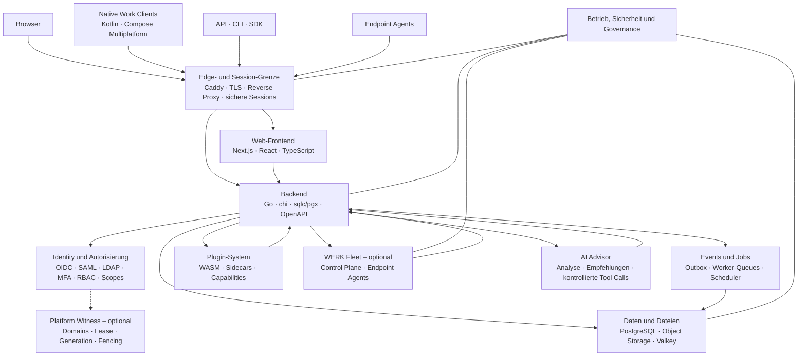

# WERK – Vision und Zielarchitektur

> **Version:** 2.2  
> **Stand:** 21.07.2026  
> **Status:** Zielbild / Architekturvision  
> **Ausrichtung:** Open Source · Self-hosted · Web und native Clients · Multi-Tenant · KI-unterstützt

---

## 1. Zweck dieses Dokuments

Dieses Dokument beschreibt das gemeinsame Zielbild für **WERK**. Es dient als verbindliche Orientierung für Produktentwicklung, Architekturentscheidungen, technische Planung und spätere Erweiterungen.

Es ist bewusst **keine vollständige Implementierungsspezifikation**. Konkrete technische Entscheidungen, Datenmodelle, API-Verträge und Migrationsschritte werden ergänzend in ADRs, OpenAPI-Spezifikationen, Moduldokumentationen und Umsetzungsplänen festgehalten.

Versionsnummern in diesem Dokument stellen den zum Zeitpunkt der Erstellung vorgesehenen Technologiestand dar. Patchstände werden nicht dauerhaft in der Architektur festgeschrieben. Maßgeblich sind eine definierte Version-Policy und automatisierte Sicherheitsupdates.

---

## 2. Leitbild

WERK ist eine **modulare Unternehmensplattform mit einem klaren Kern und optionalen Erweiterungen**.

Die Plattform soll:

- im Web sowie über installierbare, adaptive Clients bedienbar sein,
- vollständig selbst gehostet betrieben werden können,
- mehrere Mandanten sicher voneinander trennen,
- zentrale Unternehmensprozesse in einer gemeinsamen Plattform bündeln,
- kontrolliert und nachvollziehbar automatisierbar sein,
- durch Plugins, Integrationen und optionale Module erweiterbar bleiben,
- KI als unterstützendes Werkzeug einsetzen, ohne ihr unkontrollierte Administrationsrechte zu geben.

WERK wird nicht als Sammlung lose gekoppelter Einzelanwendungen verstanden, sondern als eine gemeinsame Plattform mit konsistenter Identität, Berechtigung, Datenhaltung, Auditierung, Bedienoberfläche und Erweiterungslogik.

---

## 3. Produktvision

WERK soll zum zentralen digitalen Arbeits- und Steuerungssystem eines Unternehmens werden.

Die Plattform verbindet unter anderem:

- CRM,
- Projektmanagement,
- Ticketing,
- Asset- und CMDB-Funktionen,
- Dokumentenmanagement,
- Workflows,
- Kalender und Terminplanung,
- Reporting,
- Administration,
- Integrationen,
- optionale Geräteverwaltung,
- KI-gestützte Analyse und Assistenz.

Der Kern bleibt überschaubar, wartbar und stabil. Zusätzliche Funktionen werden über klar definierte Module, Integrationen, Plugins oder optionale Plattformbereiche angebunden.

---

## 4. Architektur-Leitplanken

### 4.1 Modularer Monolith

WERK startet als **modularer Monolith mit klaren Domänengrenzen**.

Es werden nicht vorschnell Microservices eingeführt. Fachliche Module müssen intern sauber getrennt sein und über definierte Schnittstellen miteinander kommunizieren. Separate Prozesse werden dort eingesetzt, wo sie technisch sinnvoll sind, beispielsweise für Worker, Scheduler oder isolierte Erweiterungen.

### 4.2 Eine zentrale Business-API

Alle fachlichen Zugriffe laufen über eine gemeinsame, versionierte Business-API.

Das Frontend greift **nicht direkt auf PostgreSQL** oder andere interne Datenspeicher zu. Auch Desktop-Clients, CLI-Werkzeuge, SDKs, Integrationen und Agents verwenden definierte APIs.

### 4.3 Defense in Depth

Mandantentrennung und Autorisierung werden auf mehreren Ebenen durchgesetzt:

1. Anwendungsautorisierung,
2. Rollen, Scopes und Policies,
3. expliziter Tenant-Kontext,
4. PostgreSQL Row Level Security,
5. Auditierung und Re-Authentifizierung für sensible Aktionen.

Keine einzelne Schutzschicht darf als alleinige Sicherheitsgrenze betrachtet werden.

### 4.4 KI ist Berater, nicht Administrator

KI-Komponenten analysieren, erklären und empfehlen.

Sie erhalten:

- keinen direkten Datenbankzugriff,
- keinen direkten Zugriff auf Endpoint Agents,
- keine autonomen Administrationsrechte,
- keine Möglichkeit, Sicherheits- oder Freigaberegeln zu umgehen.

Jede ausführbare KI-Aktion läuft über definierte Tools, Policy-Prüfungen, Auditierung und – bei kritischen Aktionen – menschliche Freigaben.

### 4.5 Sichere Erweiterungen

Erweiterungen werden bevorzugt durch:

- WASM-Sandboxen,
- isolierte Container-Sidecars,
- versionierte HTTP- oder gRPC-Schnittstellen,
- signierte Manifeste,
- explizite Capabilities und Ressourcenlimits

umgesetzt.

Eine native Go-Plugin-ABI ist **kein Bestandteil des Produktkerns**.

---

## 5. Systemkontext



---

## 6. Clients und Zugriff

### 6.1 Web

Die Weboberfläche bleibt ein eigenständiger, voll unterstützter Client für
Workspace und Administration. Sie ist desktop-orientiert und responsiv, wird
aber nicht als Ersatz für die installierbaren Smartphone-, Tablet- oder
Desktop-Clients behandelt. Eine mögliche Browserinstallation ändert nichts an
dieser Produktgrenze.

### 6.2 Native Work-Clients

Regulär installierbare Smartphone-, Tablet- und spätere Desktop-Clients werden
mit **Kotlin Multiplatform** und **Compose Multiplatform** umgesetzt. Die ersten
Ziele sind Android und iOS beziehungsweise iPadOS; Windows, macOS und Linux
folgen nach einem produktionsnahen Mobile-Pilot und einem belastbaren
Releaseverfahren.

Die Clients teilen API-Verträge, Modelle, Zustands- und Synchronisationslogik
sowie geeignete adaptive UI-Komponenten. Plattformspezifische Adapter bleiben
für sicheren Schlüsselspeicher, Biometrie, Push, Hintergrundausführung, Dateien,
Fenster und Updates vorgesehen. Eine erzwungene vollständig identische
Oberfläche ist kein Ziel.

Der erste native Produktclient verwendet ausschließlich die `work`-
Zugriffsebene. Ein späterer Admin-Client ist ein getrenntes Produktartefakt mit
eigener Sessionablage und ausschließlich der `admin`-Audience; ein Wechsel
zwischen Work und Admin innerhalb derselben Sitzung bleibt ausgeschlossen.

Die verbindlichen Grenzen stehen in
[`ADR-013`](adr/ADR-013-native-clients-kotlin-compose-multiplatform.md) und
[`CLIENT-ARCHITEKTUR.md`](CLIENT-ARCHITEKTUR.md).

### 6.3 API, CLI und SDK

Externe und interne Automatisierung erfolgt über:

- REST/JSON,
- generierte SDKs,
- Service Accounts,
- API-Tokens,
- versionierte Verträge.

CLI und SDKs sind reguläre API-Clients und erhalten keine internen Sonderzugriffe.

### 6.4 Endpoint Agents – optional

Endpoint Agents für Windows, Linux und macOS gehören ausschließlich zum optionalen Fleet-Modul.

Ohne aktiviertes Fleet-Modul ist WERK vollständig ohne Endpoint Agents nutzbar.

---

## 7. Edge- und Session-Grenze

Der öffentliche Einstiegspunkt wird durch eine klar definierte Edge-Schicht
geschützt. Die Serversoftware besitzt unabhängig davon eine native TLS- und
mTLS-Fähigkeit; ein Reverse Proxy ist eine Betriebsoption und keine
Sicherheitsvoraussetzung des Softwarevertrags.

Vorgesehene Bestandteile:

- native TLS-Terminierung oder ein ausdrücklich vertrauenswürdiger Reverse Proxy,
- Same-Origin-Betrieb für Weboberfläche und API,
- Pfade wie `/`, `/api/v1` und `/events`,
- OIDC-basierte Sessions,
- sichere HTTP-only-Cookies,
- API-Tokens für nicht interaktive Clients,
- Rate Limits,
- Security Header,
- SSE oder WebSocket für Live-Status.

Die Edge-Schicht ist keine fachliche Autorisierungsschicht. Sie ergänzt die
Sicherheitsmechanismen des Backends. Transportidentität, Policy und
Authority-Lease bleiben getrennte Prüfungen. Der verbindliche native
Transportvertrag steht in
[`ADR-023`](adr/ADR-023-native-server-tls-und-transportidentitaet.md);
Änderungen vorbehalten.

---

## 8. Identity und Autorisierung

WERK besitzt mit **Core Identity** eine eigene interne Identitäts- und
Zugriffsschicht. Sie verwaltet Konten, Kontoarten, Sessions, Tenant-Kontext,
Zugriffsebenen und Berechtigungsentscheidungen. WERK kann damit selbst als
interner Identity Provider arbeiten.

Externe Identity Provider sind optionale Adapter und keine Voraussetzung für
den Betrieb. Vorgesehene spätere Adapter sind OIDC, SAML oder LDAP. Ein Adapter
darf nur die Identität bestätigen; Kontoart, Tenant-Zuordnung, Session-Audience,
Berechtigungen und Audit bleiben unter der Kontrolle von Core Identity.

Sicherheitsbausteine:

- MFA,
- WebAuthn,
- RBAC,
- Scopes,
- Tenant-Kontext,
- Audit-Protokollierung,
- Re-Authentifizierung für sensible Aktionen.

Jede fachliche Anfrage muss eindeutig einem Benutzer, Service Account oder
registrierten Agenten sowie einem Tenant zugeordnet werden. Agenten verwenden
technische Credentials; Modell- und Toolzugriffe bleiben ressourcenbezogene,
auditierte Policy-Entscheidungen.

Mehrere Core- oder Identity-Prozesse an derselben autoritativen
PostgreSQL-Datenbank bilden noch keine zweite Identity-Autorität. Eine spätere
zweite Instanz mit eigener Datenbankkopie arbeitet Active/Passive als Replik
desselben Identity-Realms. Automatischer Failover benötigt einen unabhängigen,
QDevice-artigen Platform Witness mit `identity-control`, eine zeitlich begrenzte
exklusive Lease, eine
monoton steigende Autoritätsgeneration und technisches Fencing der bisherigen
Hauptinstanz. Ein Healthcheck liefert lediglich ein Ausfallsignal und darf
niemals allein Schreibhoheit vergeben. Der Witness hält keine Konten,
Credentials, Schlüssel oder Fachdaten. Die verbindlichen Grenzen beschreibt
[`ADR-015`](adr/ADR-015-identity-authority-witness-und-failover.md) zusammen mit
[`ADR-022`](adr/ADR-022-deploymentprofile-und-platform-witness.md).

Fachliche Freigaben gehören ausschließlich in die `work`-Zugriffsebene. Auch
ein Plattformadministrator darf keine Unternehmens- oder Kundenentscheidung
freigeben. Leitungsfunktionen werden als tenantgebundene Arbeitsrollen
modelliert. Für besonders folgenreiche Entscheidungen kann eine versionierte
Policy aktive Re-Authentifizierung, Mehrpersonenfreigabe und ein kurzlebiges,
auf genau eine Ressource gebundenes Just-in-Time-Recht verlangen. Ein solches
Recht wechselt niemals die Kontoart und kann nicht unkontrolliert selbst erteilt
werden.

Die Plattform bildet den gemeinsamen Organisationsraum eines Unternehmens ab.
Hierarchische Organisationseinheiten formen Bereiche, Abteilungen und Teams;
tenantgebundene Access-Gruppen verbinden Personen und Einheiten zusätzlich
quer zur Hierarchie. Eine Abteilung bleibt dabei eine innere Schale desselben
Tenants und wird nicht ohne echte Daten- oder Rechtsgrenze zum eigenen Tenant.

Fachapps werden pro Tenant aktiviert und anschließend ausdrücklich für eine
Organisationseinheit, eine Access-Gruppe oder ausnahmsweise ein einzelnes
Work-Konto freigeschaltet. Diese App-Freischaltung ersetzt weder Rolle noch
Ressourcenberechtigung. Den ausführbaren Basisvertrag beschreibt
[`ADR-018`](adr/ADR-018-organisationskoordinaten-und-app-entitlements.md).

---

## 9. Frontend und Clients

### Web-Zielstack

- Next.js 16.x
- React 19.2
- TypeScript 5.x
- Node.js 24 LTS
- App Router
- typisierter, generierter OpenAPI-Client

### Nativer Client-Zielstack

- Kotlin Multiplatform für geteilte Clientlogik,
- Compose Multiplatform für adaptive Work-Oberflächen,
- reguläre Android-, iOS-/iPadOS- und spätere Desktop-Artefakte,
- plattformspezifische Adapter hinter gemeinsamen Verträgen,
- typisierter, aus OpenAPI abgeleiteter API-Client.

### Grundsätze

- Keine direkte Datenbankverbindung.
- Web- und native Clients verwenden dieselben versionierten Business-APIs und
  erhalten keine clientabhängigen Sonderrechte.
- Serverseitige Daten bevorzugt über React Server Components und einen kontrollierten Query-Cache.
- Lokaler Zustand nur für UI-spezifische Zustände.
- Native Offline-Daten sind verschlüsselte Projektionen; PostgreSQL bleibt die
  fachliche Wahrheit und der Server entscheidet Konflikte und Berechtigungen.
- Berechtigungen im Frontend dienen der Benutzerführung, ersetzen aber niemals die Backend-Autorisierung.
- Fachmodule verwenden gemeinsame UI-, Navigations- und Berechtigungskonzepte.

### Visuelle Grundhaltung

Das
[WERK-UI-Konzept](https://github.com/dytonpictures/conzept-temp-werk) dient als
unverbindliche visuelle Inspirations- und Diskussionsgrundlage. Es ist keine
starre Layout- oder Ablaufspezifikation. Als gemeinsame Gestaltungsrichtung
gelten zunächst:

- ruhig, industriell und desktop-orientiert statt werblich inszeniert,
- helle, neutrale Arbeitsflächen mit einem klaren, konfigurierbaren Akzent,
- kompakte bis angenehme Informationsdichte auf einem konsistenten Raster,
- kleine Radien, feine Linien und zurückhaltende Schatten,
- klare Typografie und Statusdarstellung statt dekorativer Effekte,
- dieselben zugänglichen UI-Primitiven für Core, Capabilities und Fachmodule.

Betreiber-Branding darf Logo und Akzentfarbe anpassen, ohne Kontrast,
Zugänglichkeit, Sicherheitskennzeichnungen oder die Trennung von Arbeits- und
Administrationsbereich aufzuheben.

### Vorgesehene Oberflächenmodule

- Dashboard
- CRM
- Projekte
- Tickets
- Assets / CMDB
- Dokumente
- Workflows
- Kalender
- Reports
- Administration
- Plugins
- KI-Assistent

---

## 10. Backend

### Zielstack

- Go 1.26.5 oder neuer innerhalb der unterstützten Go-Kompatibilitätslinie
- chi
- sqlc / pgx
- OpenAPI 3.1 beziehungsweise 3.2
- PostgreSQL als primäres System of Record

### Architektur

Das Backend ist ein modularer Monolith mit klaren Domänengrenzen.

Worker, Scheduler und andere asynchrone Aufgaben können als separate Prozesse aus demselben Codebestand oder aus klar abgegrenzten Komponenten betrieben werden.

### Vorgesehene Backend-Module

- Tenants
- IAM-Adapter
- Benutzer und Rollen
- CRM
- Projekte
- Tickets
- Assets / CMDB
- Dokumente
- Workflows
- Scheduler
- Benachrichtigungen
- Integrationen
- Webhooks
- Audit
- Fleet Control API
- AI Tool API

### API-Konventionen

- versionierter Einstieg unter `/api/v1`,
- Pagination und Filter,
- Idempotency Keys,
- ETags,
- standardisierte Fehler nach RFC 9457,
- generierte Clients,
- explizite Tenant-Zuordnung,
- konsistente Authentifizierung und Autorisierung.

---

## 11. Events und Jobs

Asynchrone Verarbeitung muss verlässlich, wiederholbar und nachvollziehbar sein.

Vorgesehene Mechanismen:

- PostgreSQL Transactional Outbox,
- Apache Kafka als mitgelieferter, persistenter Distributionspfad für
  Domain-Events, minimierte Security-Audits und strukturierte Betriebslogs,
- Valkey Streams oder dedizierte Worker-Queues,
- Retries,
- Dead Letter Queues,
- Idempotenz,
- Scheduler,
- Backpressure.

Redis- beziehungsweise Valkey-Pub/Sub wird nur für **flüchtige Live-Events** verwendet und nicht als Grundlage für verbindliche Jobs.

PostgreSQL bleibt über die Systemgrenze hinweg die fachliche und auditierbare
Wahrheit. Kafka-Zustellung erfolgt aus atomaren Outbox-/Audit-Queues mindestens
einmal; stabile Event-IDs ermöglichen Deduplizierung. Domain-Events, Audits und
Logs verwenden getrennte Topics, ACLs und Retention. Ihr gemeinsames,
versioniertes Envelope enthält begrenzte Klassifikations-, Zweck- und
Aufbewahrungstags. Der aktuelle Vertrag steht in
[`ADR-020`](adr/ADR-020-kafka-event-audit-und-log-streaming.md); Änderungen
vorbehalten.

---

## 12. Daten und Dateien

### PostgreSQL

PostgreSQL ist das primäre System of Record.

Vorgesehene Sicherheits- und Mandantenmechanismen:

- `tenant_id` in mandantenbezogenen Datensätzen,
- Row Level Security,
- `FORCE ROW LEVEL SECURITY`,
- Non-Owner-App-Role,
- keine alltäglichen Zugriffe mit Eigentümer- oder Superuser-Rollen.

### Object Storage

Dokumente, Anhänge und Artefakte werden über einen eigenen internen Dokument-
und Storage-Dienst in einem S3-kompatiblen Object Store gespeichert. „Dienst“
bezeichnet zunächst getrennte Core-Domänen im modularen Monolithen und noch
keine vorzeitige Microservice- oder Datenbankaufteilung.

Core Documents besitzt Dokumente, unveränderliche veröffentlichte Versionen,
Klassifikation, Aufbewahrungszuordnung und fachliche Sichtbarkeit. Core Storage
besitzt Blobs, opake Locations, Quarantäne, Transferzustand und Provideradapter.
Metadaten, Tenant-Bindungen, Hashes und Berechtigungsbezüge verbleiben in
PostgreSQL; der Provider besitzt ausschließlich die Bytes.

Clients erhalten keine dauerhaften Storage-Credentials und keine frei
wählbaren Objektpfade. Der erste Transfervertrag verwendet kurzlebige,
ressourcengebundene Einmaltickets an einem Backend-Endpunkt. Ein späterer
Collaboration-/Sync-Dienst besitzt nur veränderliche Arbeitskopien und
veröffentlicht akzeptierte Änderungen als neue Dokumentversion. Die verbindliche
Trennung steht in [`ADR-021`](adr/ADR-021-interner-dokument-blob-und-transfervertrag.md);
Änderungen vorbehalten.

### Valkey

Valkey wird verwendet für:

- Cache,
- Sessions,
- kurzlebige Zustände,
- Streams beziehungsweise Worker-Queues, sofern passend.

Valkey ist nicht das dauerhafte fachliche System of Record.

### Vektorsuche

`pgvector` kann optional eingesetzt werden.

Jede Vektorsuche muss konsequent tenant-gefiltert und in die bestehende Autorisierung eingebunden sein.

### Datensicherung

- WAL-basierte Sicherungen,
- verschlüsselte Off-Site-Backups,
- regelmäßige Restore-Tests,
- dokumentierte Wiederherstellungsverfahren.

---

## 13. Plugin-System

Das Plugin-System ist:

- isoliert,
- versioniert,
- erlaubnisbasiert,
- auditierbar,
- ressourcenbegrenzt.

### Ausführungsmodelle

#### WASM-Sandbox

Geeignet für:

- Low-Trust-Logik,
- kleinere Regeln,
- Transformationen,
- kontrollierte Erweiterungspunkte.

#### Container-Sidecars

Geeignet für:

- umfangreichere Integrationen,
- eigene Laufzeitabhängigkeiten,
- rechenintensive Verarbeitung,
- externe Adapter.

Die Kommunikation erfolgt über gRPC oder HTTP.

### Sicherheitsanforderungen

- signierte Manifeste,
- deklarierte Capabilities,
- CPU-Limits,
- RAM-Limits,
- Timeouts,
- Netzwerk- und Datenzugriff nur nach Freigabe,
- keine native Go-Plugin-ABI,
- keine Umgehung der Business-API.

KI greift auf Plugins nur über die kontrollierte AI Tool API zu.

---

## 14. WERK Fleet – optional

WERK Fleet erweitert die Plattform um Endpoint- und Device-Management.

Das Modul ist optional und darf den sicheren Betrieb der Kernplattform nicht voraussetzen.

### 14.1 Control Plane

Aufgaben des Control Plane:

- Enrollment und PKI,
- Command Queue,
- Rollout-Policies,
- Approval-Policies,
- revisionssichere Aktionsprotokolle.

Jede Aktion ist:

- tenantgebunden,
- autorisiert,
- nachvollziehbar,
- revisionssicher.

### 14.2 Agent-Kommunikation

Agents kommunizieren ausschließlich outbound.

Vorgesehen sind:

- mTLS,
- individuelle Geräte-Zertifikate,
- signierte Updates,
- kontrollierte Enrollment-Prozesse.

Unterstützte Zielsysteme:

- Windows,
- Linux,
- macOS.

### 14.3 Gerätefunktionen

- Inventar und Heartbeats
- Monitoring und Alerts
- Patch- und Software-Rollouts
- Canary-Rollouts
- Wartungsfenster
- Rollback
- Remote-Aktionen nur Just-in-Time und mit Re-Authentifizierung
- vollständige Auditierung

Remote Shell ist ausschließlich zulässig mit:

- Just-in-Time-Freigabe,
- MFA beziehungsweise Re-Authentifizierung,
- Auditierung,
- optionaler zusätzlicher menschlicher Freigabe.

---

## 15. AI Advisor

Der AI Advisor unterstützt Benutzer bei Analyse, Recherche, Erklärung und Handlungsempfehlungen.

Er arbeitet standardmäßig **read-only**.

### Kontrollierter Ausführungsweg

```text
Benutzeranfrage
    → KI-Analyse
    → Tool Call
    → Policy-Prüfung
    → gegebenenfalls menschliche Freigabe
    → deterministischer Worker
    → Ausführung
    → Audit-Protokoll
```

### Sicherheitsregeln

- kein direkter Zugriff auf PostgreSQL,
- kein direkter Zugriff auf Endpoint Agents,
- keine autonome Administration,
- keine Umgehung von Rollen, Scopes oder Tenant-Grenzen,
- Prompt- und Tool-Audit,
- Redaction sensibler Inhalte,
- Tenant-Isolation,
- nachvollziehbare Freigaben.

> **Grundsatz:** Kein autonomer Administrator.

---

## 16. Betrieb, Sicherheit und Governance

Betrieb, Sicherheit und Governance sind Querschnittsfunktionen für die Kernplattform und das optionale Fleet-Modul.

### 16.1 Deployment

Vorgesehene Betriebsprofile:

- Ubuntu 24.04 oder 26.04 LTS,
- Docker Engine und Docker Compose für ein Single-Host-Profil,
- mehrere Prozesse an einer gemeinsamen PostgreSQL-Wahrheit als erste
  horizontale Betriebsstufe,
- separate Active/Passive-HA-Variante mit replizierter Datenhaltung und
  unabhängigem Platform Witness, ohne einen bestimmten Orchestrator vorzugeben.

Container und Dienste sollen möglichst:

- non-root laufen,
- ein read-only Dateisystem verwenden,
- Healthchecks bereitstellen,
- minimale Berechtigungen besitzen.

### 16.2 Identity-Hochverfügbarkeit und Mehrinstanzbetrieb

Das heutige Startprofil ist eine einzelne Installation mit genau einer
autoritativen PostgreSQL-Datenbank. Prozessredundanz innerhalb dieses Profils
teilt Widerrufe, Sessions und Sicherheitszähler über dieselbe Datenbank.

Eine spätere zweite Instanz ist keine unabhängige Identity-Quelle. Sie übernimmt
erst nach bestätigter Replikationsschranke und exklusiver Entscheidung des
Platform Witness in der Domain `identity-control`. Ohne erreichbaren Witness
gibt es zwischen zwei Instanzen
keinen automatischen Failover; ein manueller Wechsel muss die alte
Hauptinstanz nachweislich ausgrenzen und vollständig auditiert werden.

Das HA-Profil gilt erst als produktionsreif, wenn Netztrennung, Witness-Ausfall,
Replikationsverzug, Schlüsselrotation, Rückkehr der alten Hauptinstanz und
Wiederherstellung regelmäßig getestet werden. Exakte globale Credential-Zähler
dürfen bei einem Failover nur fortgeführt werden, wenn ihre verlustfreie
Replikation nachgewiesen ist; andernfalls wird fail-closed abgelehnt.

### 16.3 Observability

- OpenTelemetry Collector
- Prometheus
- Grafana
- Loki
- Tempo
- strukturierte Logs
- Trace- und Request-IDs
- SLOs
- Alerts
- Readiness-Prüfungen
- Runbooks

### 16.4 Security und Supply Chain

- Secrets über SOPS/age oder Vault
- SBOM im SPDX-Format
- SAST
- SCA
- Image-Scanning
- signierte Images und Artefakte mit Cosign
- TUF-orientierte Updateverfahren
- OWASP ASVS 5 als Sicherheitsreferenz

### 16.5 Backup, Disaster Recovery und Privacy

- WAL/pgBackRest oder WAL-G
- verschlüsselte Off-Site-Sicherungen
- regelmäßige Restore-Drills
- definierte RPO- und RTO-Ziele
- Retention-Regeln
- Datenexport
- Löschkonzepte
- Datenminimierung

WERK wird als **DSGVO-fähig** konzipiert. Die konkrete Compliance bleibt
abhängig von Konfiguration, Betriebsprozessen, Verträgen und Nutzung in der
Verantwortung des jeweiligen Betreibers.

Autorisierung und zulässige Datenverarbeitung bleiben getrennte Prüfschichten.
Jeder autorisierbare Ressourcentyp besitzt deshalb ein verbindliches,
versioniertes Datenprofil; jede Permission-Ressourcentyp-Kombination besitzt
eine serverseitige Processing-Policy. Eine Rolle oder ein API-Schlüssel liefert
niemals selbst eine Rechtsgrundlage. Anforderungen werden von EU- und
nationalem Recht über sektor- und betreiberspezifische Pflichten bis zu
Plattform-, Tenant- und App-Regeln nur weiter eingeschränkt. Den ersten
ausführbaren Vertrag und seine bewusst noch offenen Governance-Abläufe beschreibt
[`ADR-017`](adr/ADR-017-eu-compliance-und-datenverarbeitungsgrundlage.md).

---

## 17. Wichtige Grenzen und Nicht-Ziele

1. Keine native Go-Plugin-ABI im Produktkern.
2. Redis- oder Valkey-Pub/Sub wird nicht für verbindliche Jobs verwendet.
3. Remote Shell ist nur mit JIT-Freigabe, MFA/Re-Auth, Audit und optionaler menschlicher Freigabe zulässig.
4. Es wird von „DSGVO-fähig“ gesprochen, nicht pauschal von „DSGVO-konform“.
5. Responsiver Webzugang ersetzt keinen nativen Client; vollständige Offline-
   Synchronisation wird als eigenständiges, serverautorisiertes Feature geplant.
6. Das Frontend greift niemals direkt auf die Datenbank zu.
7. KI erhält keine autonomen Administrationsrechte.
8. Das Fleet-Modul bleibt optional.
9. Microservices werden nur eingeführt, wenn klare technische oder organisatorische Gründe vorliegen.
10. Erweiterungen dürfen Mandantentrennung, Autorisierung und Auditierung nicht umgehen.

---

## 18. Roadmap

Die verbindliche, umsetzbare Roadmap liegt in
[ROADMAP.md](ROADMAP.md). Ihre Reihenfolge schützt den Plattformkern vor
fachlicher Vorfestlegung:

1. Architektur und Lieferfähigkeit
2. Sicherheits- und Organisationskern
3. Gemeinsame Daten-, Beziehungs- und Ereignisplattform
4. Arbeitskoordination als Core-Capabilities
5. Ein realer fachlicher End-to-End-Pilot
6. Kontrollierte Plugins, Integrationen und KI
7. Weitere Fachanwendungen, Fleet und Produktreife

CRM, Projekte, Tickets, Assets/CMDB, Dokumente und Workflows sind damit keine
voneinander unabhängigen Startpunkte. Sie werden in der Roadmap erst als
Fachanwendungen oder Core-Capabilities umgesetzt, nachdem sie die gemeinsamen
Sicherheits-, Daten- und Ereignisregeln zuverlässig verwenden können.

---

## 19. Architekturentscheidungen und Dokumentation

Größere technische Entscheidungen werden als Architecture Decision Records festgehalten.

Mindestens folgende Bereiche benötigen eigene ADRs:

- Mandantenmodell und RLS-Strategie
- Core Identity und optionale externe Identity-Provider-Adapter
- API-Versionierung
- Transactional Outbox und Queue-System
- Dokumenten- und Object-Storage-Modell
- Plugin-Laufzeit und Capability-Modell
- Fleet-PKI und Agent-Enrollment
- KI-Tool- und Freigabemodell
- native Clientarchitektur sowie Mobile-/Desktop-Authentifizierung
- Single-Host- und HA-Betriebsprofil
- Identity-Autorität, Replikation, Witness, Lease und Fencing
- Backup-, Restore- und Disaster-Recovery-Strategie
- Release-Kanäle, Artefaktintegrität und Softwarelieferkette

---

## 20. Definition des Zielzustands

Die Zielarchitektur gilt als erreicht, wenn:

- alle Kernmodule dieselbe Identity-, Tenant-, Berechtigungs- und Audit-Infrastruktur verwenden,
- kein Client die Datenbank direkt anspricht,
- Web und native Clients dieselben Kontoart-, Tenant-, API- und Auditgrenzen
  einhalten,
- API-Verträge versioniert und maschinenlesbar vorliegen,
- tenantbezogene Daten auf Anwendungs- und Datenbankebene geschützt sind,
- verbindliche Hintergrundjobs wiederholbar und ausfallsicher verarbeitet werden,
- Plugins isoliert und nur über deklarierte Capabilities ausgeführt werden,
- KI-Aktionen über kontrollierte Tools und Policies laufen,
- Fleet vollständig optional bleibt,
- ein HA-Profil niemals zwei gleichzeitig schreibende Identity-Autoritäten
  zulässt und automatischen Zwei-Instanz-Failover nur mit unabhängigem Witness
  aktiviert,
- Backups nachweislich wiederherstellbar sind,
- Observability, Security und Governance nicht nachträglich, sondern als Plattformfunktionen umgesetzt sind.

---

## 21. Kurzfassung

WERK ist eine selbst gehostete, mandantenfähige und modular erweiterbare Unternehmensplattform.

Der Kern wird als modularer Monolith mit einer gemeinsamen Business-API umgesetzt. PostgreSQL bildet das System of Record und erzwingt zusätzliche Mandantentrennung durch Row Level Security. Die eigenständige Weboberfläche und installierbare Kotlin-/Compose-Multiplatform-Clients verwenden dieselben Verträge und Sicherheitsgrenzen. Erweiterungen laufen isoliert über WASM oder Sidecars. Geräteverwaltung wird als optionales Fleet-Modul realisiert. KI unterstützt bei Analyse und Empfehlungen, bleibt jedoch durch Tools, Policies, Freigaben und Auditierung kontrolliert.

Die Plattform soll langfristig die technische Basis für zentrale Unternehmensprozesse, Integrationen und Erweiterungen bilden, ohne Wartbarkeit, Sicherheit oder Betreiberkontrolle zugunsten kurzfristiger Funktionsvielfalt aufzugeben.
